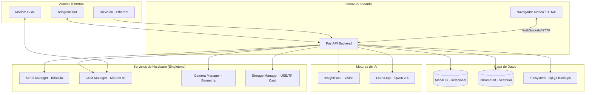

***

# Documento de Diseño de Software (SDD)

**Proyecto:** Sistema Inteligente de Pesaje y Control de Calidad (SIP-Edge)  
**Versión:** 1.0  
**Basado en:** ERS v1.0

---

## 1. Introducción

### 1.1 Propósito
Este documento detalla la arquitectura técnica y el diseño de componentes para el sistema **SIP-Edge**. Define la infraestructura necesaria para soportar el pesaje industrial, la biometría facial, el procesamiento de lenguaje natural y la gestión de periféricos (Báscula y Módem GSM) en un entorno industrial.

### 1.2 Alcance del Diseño
Cubre la persistencia en MariaDB, la lógica asíncrona en FastAPI, la integración de modelos de IA y la administración de hardware bajo restricciones de seguridad y contingencia.

---

## 2. Arquitectura del Sistema

### 2.1 Estilo Arquitectónico
Se utiliza una **Arquitectura de Capas Asíncrona**. El núcleo del sistema reside en el EdgeBox RPi-200, gestionando procesos concurrentes mediante el bucle de eventos de Python (asyncio) para evitar bloqueos durante las inferencias de IA o lecturas de hardware.

### 2.2 Diagrama de Arquitectura (Mermaid)

---

## 3. Estrategia de Diseño y Patrones

### 3.1 Patrones de Hardware e Integridad
*   **Singleton (Instancia Única):** Aplicado a `SerialManager` (Báscula) y `GSMManager` (Módem). Garantiza que solo un hilo controle la comunicación AT y la recepción de tramas de peso.
*   **State Pattern (Estado del Formulario):** Controla el **[RNF-006] (Candado de Hardware)**. El campo de peso cambia de estado `READONLY` a `EDITABLE` únicamente mediante un evento de autorización firmado por el servicio de Telegram.

### 3.2 Patrones de Datos y Lógica
*   **Repository Pattern:** Centraliza el CRUD de usuarios, haciendas y suertes. Implementa el borrado lógico para haciendas con historial para cumplir con **[RF-008]**.
*   **Cascading Service:** Lógica específica para filtrar registros de `Suertes` basándose en el ID de `Hacienda` seleccionado, inyectando fragmentos HTML mediante HTMX.

---

## 4. Diseño de Componentes Críticos

### 4.1 Módulo de Administración (Hardware y Backups)
*   **Configurador de Puertos:** Lee/Escribe un archivo `config.yaml`. Al cambiar parámetros (Baudrate, Paridad), el sistema reinicia el Singleton correspondiente.
*   **Motor de Backups:** 
    *   **Automático:** Tarea `cron` que ejecuta `mysqldump` | `gzip`.
    *   **Manual (USB):** Usa `psutil` para detectar puntos de montaje en `/media/` y `shutil` para la transferencia con verificación de integridad (Hash MD5/SHA256).

### 4.2 Módulo de Identidad y Biometría
*   **Enrolamiento:** Captura de frame -> Detección de puntos clave -> Generación de Embedding (vector 512-d).
*   **Validación:** Comparación de distancia coseno entre el rostro en vivo y el almacenado. Umbral de similitud para duplicados: **0.90**.
*   **Handshake Telegram:** Generación de OTP (One-Time Password) en DB con expiración de 10 minutos para vinculación de Chat ID.

### 4.3 Módulo de IA (TinyLLM)
*   **Inferencia:** Qwen 2.5 - 3B en modo "Function Calling".
*   **Herramientas SQL:** Funciones Python que encapsulan consultas `SELECT` específicas para evitar alucinaciones en el cálculo de promedios o detección de anomalías.

---

## 5. Diseño de Base de Datos (MariaDB)

### 5.1 Esquema Relacional Principal

1.  **haciendas:** `id (PK), nombre, codigo, activo (bool)`.
2.  **suertes:** `id (PK), hacienda_id (FK), nombre, variedad, activo (bool)`.
3.  **usuarios:** `id (PK), nombre, documento, rol (enum), facial_embedding (blob), telegram_chat_id, activo (bool)`.
4.  **asistencia_log:** `id (PK), usuario_id (FK), timestamp_entrada, origen (Hikvision)`.
5.  **pesajes:** 
    *   `id (PK), timestamp, usuario_id (FK), hacienda_id (FK), suerte_id (FK)`.
    *   `peso_valor (decimal), materia_extraña (decimal)`.
    *   `es_manual (bool), autorizador_id (FK, nullable)`.

---

## 6. Especificaciones de Implementación

### 6.1 Manejo de Energía y Contingencia
*   **Monitor de UPS:** Script de fondo que monitorea la entrada de energía (si el EdgeBox lo permite vía GPIO/I2C).
*   **Modo Manual:** El sistema bloquea el envío del formulario si `es_manual == true` y no existe un `autorizador_id` válido en la sesión actual.

### 6.2 Comunicación GSM
*   **Librería:** `pyserial` para comandos AT.
*   **Función:** El sistema utiliza el módulo GSM para la salida de datos hacia los servidores de Telegram (vía APN privado/OIT SIM), asegurando que el dispositivo no sea accesible desde la internet pública.

### 6.3 Gestión de Procesos (Systemd)
Se crearán tres servicios principales:
1.  `sip-edge-api.service`: El backend FastAPI (Puerto 8000).
2.  `sip-edge-hardware.service`: Servicio de lectura constante de báscula y módem.
3.  `sip-edge-worker.service`: Procesamiento de tareas pesadas (Backups y limpieza de logs).

---

## 7. Requisitos de Seguridad de Software
*   **ORM:** SQLAlchemy para prevenir inyección SQL en todos los CRUDs (Haciendas, Suertes, Usuarios).
*   **Validation:** Uso de `Pydantic` para validar que las coordenadas y valores de peso sean numéricos antes de cualquier operación lógica.

***

Este diseño asegura que el sistema sea **auditable**, **seguro** y capaz de operar bajo las condiciones de **contingencia** (entrada manual) y **aislamiento** (GSM/Offline) requeridas para el laboratorio de cañas.