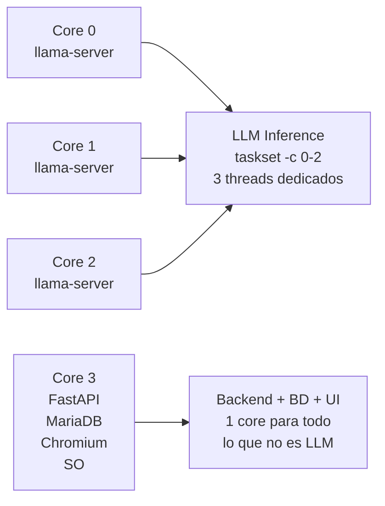
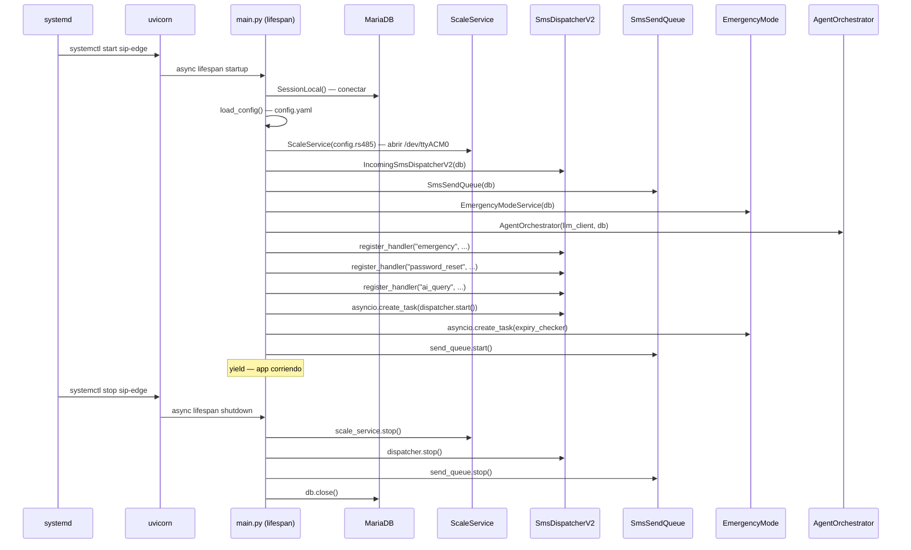
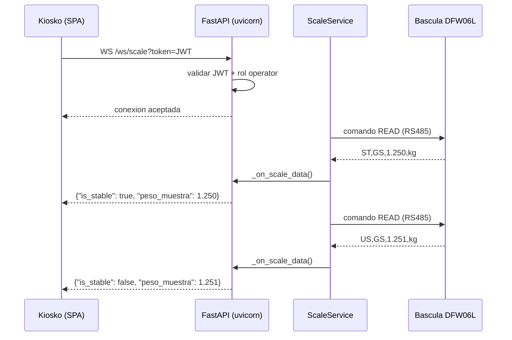
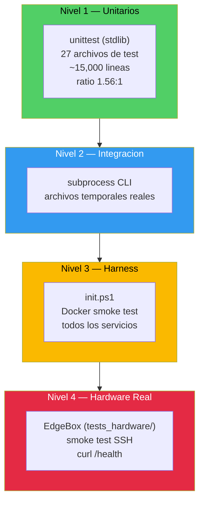
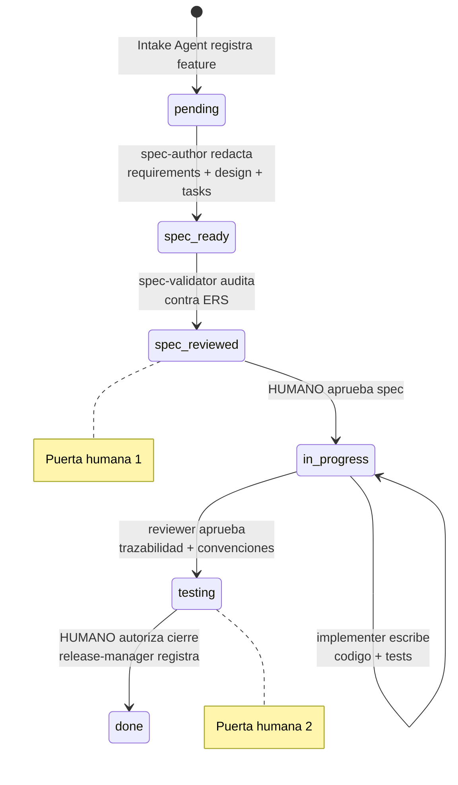

# Documento de Diseno de Software (SDD) — SIP-Edge

> **Version:** 1.0
> **Fecha:** Julio 2026
> **Proyecto:** Sistema Inteligente de Pesaje y Control de Materia Extrana
> **Plataforma:** EdgeBox-RPI-200 (SeeedStudio, Raspberry Pi CM4, 8 GB RAM, 32 GB eMMC)
> **Cliente:** Ingenio Mayaguez S.A.

---

## Indice

1. [Resumen Ejecutivo](#1-resumen-ejecutivo)
2. [Stack Tecnologico](#2-stack-tecnologico)
3. [Arquitectura del Sistema](#3-arquitectura-del-sistema)
4. [Estructura del Codigo Fuente](#4-estructura-del-codigo-fuente)
5. [Modelo de Datos](#5-modelo-de-datos)
6. [Diseno de API](#6-diseno-de-api)
7. [Seguridad](#7-seguridad)
8. [Patrones de Diseno](#8-patrones-de-diseno)
9. [Estrategia de Pruebas](#9-estrategia-de-pruebas)
10. [Metodologia de Desarrollo — Spec Driven Development](#10-metodologia-de-desarrollo--spec-driven-development)
11. [Build y Despliegue](#11-build-y-despliegue)
12. [Dependencias Externas](#12-dependencias-externas)
13. [Mejoras Futuras](#13-mejoras-futuras)

---

## 1. Resumen Ejecutivo

SIP-Edge es un sistema *standalone* desplegado en hardware de borde (EdgeBox-RPI-200)
para el registro, analisis y reporte de pesajes de materia extrana en laboratorios de cana
de azucar. Opera 100% offline con conectividad SMS via modem 4G para notificaciones y
comandos remotos.

### Metricas del proyecto

| Metrica | Valor |
|---------|-------|
| Modulos Python (src/) | 29 modulos, ~9,610 lineas |
| Tests unitarios/integracion | 27 archivos, ~15,000 lineas |
| Ratio test/codigo | ~1.56:1 |
| Features implementadas | 41 (31 funcionalidades + 9 bugs corregidos + 1 dev tool) |
| Tablas de base de datos | 12 |
| Endpoints REST | 45+ |
| Migraciones de BD | 20 (14 SQL + 6 Python) |

---

## 2. Stack Tecnologico

### 2.1 Backend

| Componente | Tecnologia | Version | Justificacion |
|------------|-----------|---------|---------------|
| Lenguaje | Python | 3.13+ | Unico runtime en EdgeBox; stdlib rica sin dependencias externas |
| Framework Web | FastAPI | 0.115.6 | Async nativo (asyncio), ideal para I/O serial y GSM concurrente |
| Servidor ASGI | uvicorn | 0.34.0 | Rendimiento en ARM64; WebSocket nativo |
| ORM | SQLAlchemy | 2.0.36 | Mapeo objeto-relacional con soporte MariaDB + SQLite (dev) |
| Driver BD | PyMySQL | 1.1.1 | Pure Python, sin binarios nativos (compatibilidad ARM64) |
| Validacion | Pydantic | 2.10.3 | Schemas tipados para API; validacion automatica de requests |
| Auth | python-jose + bcrypt | 3.3.0 / 4.2.1 | JWT con firma HMAC-SHA256; hash de passwords |
| Serial | pyserial | 3.5 | Comunicacion RS485/RS232 con bascula y PC externo |
| HTTP Client | httpx | 0.28.1 | Cliente async para llamadas al LLM (llama-server) |
| WebSocket | websockets | 14.1 | Lecturas de bascula en tiempo real para el kiosco |
| Configuracion | PyYAML + python-dotenv | 6.0.2 / 1.0.1 | config.yaml para hardware; .env para secretos |

### 2.2 Frontend (SPA)

| Componente | Tecnologia | Version | Justificacion |
|------------|-----------|---------|---------------|
| Framework | Svelte 5 | — | Compilado a JS puro; sin runtime (< 0 KB overhead) |
| Build tool | Vite | 6+ | Tree-shaking; HMR en desarrollo |
| Ruteo | svelte-spa-router | — | Ligero (~3 KB); 11 rutas planas |
| CSS | Vanilla CSS + variables | — | Sin frameworks de UI (peso innecesario en kiosco industrial) |
| Node.js (build) | Node.js | 22 LTS | Solo en maquina de desarrollo. No requerido en produccion. |

### 2.3 Infraestructura

| Componente | Tecnologia | Version | Ubicacion |
|------------|-----------|---------|-----------|
| SO | Debian (Raspberry Pi OS) | 13 (Trixie) aarch64 | eMMC 32 GB |
| Base de Datos | MariaDB | 11.8.6 | localhost:3306 |
| Motor LLM | llama.cpp | b9632 (ggml v0.15.1) | localhost:8080 |
| Modem | ModemManager (mmcli) | — | Quectel EC25, /dev/ttyUSB2-3 |
| Service Manager | systemd | — | sip-edge.service |
| Desarrollo local | Docker Compose | — | Backend + MariaDB + phpMyAdmin |

---

## 3. Arquitectura del Sistema

### 3.1 Diagrama de Capas

```mermaid
graph TD
    frontend["SPA Svelte 5 + Vite<br/>src/static/ · puerto 8000"] -->|REST + WebSocket| backend

    subgraph backend["BACKEND — FastAPI + uvicorn"]
        api["main.py<br/>rutas, lifespan,<br/>WebSocket, CORS"]
        auth_mod["auth.py<br/>JWT, RBAC,<br/>bloqueo inactividad"]
        bd_module["models.py<br/>ORM SQLAlchemy<br/>12 tablas"]
        config_mod["config.py<br/>dataclasses frozen<br/>config.yaml"]
        crud_mod["users · haciendas · weighings<br/>CRUD + soft-delete"]
        scale_mod["scale.py<br/>RS485 bascula<br/>DFW06L"]
        rs232_mod["rs232.py<br/>trama CSV<br/>PC externo"]
        sms_mod["sms_service · dispatcher_v2<br/>sms_persistence · send_queue<br/>envio + recepcion SMS"]
        emerg_mod["emergency_mode<br/>modo manual<br/>solicitud + aprobacion"]
        reset_mod["password_reset<br/>reset remoto<br/>via SMS + PIN"]
        agent_mod["agent_orchestrator<br/>ai_multi_turn<br/>LLM + tools + multiturno"]
        anomaly_mod["anomaly_detector<br/>3 capas: Z-Score<br/>ratios, temporal"]
        tools_mod["sql_tools<br/>14 herramientas<br/>SQL parametrizadas"]
        reports_mod["report_templates<br/>plantillas<br/>9 metricas"]
        backup_mod["backup.py<br/>dump + rotacion<br/>exportacion USB"]
    end

    backend -->|SQLAlchemy + PyMySQL| mariadb["MariaDB 11.8<br/>users · haciendas · suertes<br/>weighings · emergency_mode_log<br/>report_templates · anomaly_log<br/>backup_logs · sms_conversations<br/>sms_messages · sms_ai_tool_log"]
    backend -->|HTTP localhost| llamacpp["llama.cpp :8080<br/>Qwen 2.5 1.5B Q4_K_M<br/>cores 0-2 · taskset"]
    sms_mod -->|AT commands mmcli| modem["Modem 4G<br/>Quectel EC25<br/>SMS + datos"]
    scale_mod -->|pyserial| rs485["RS485 /dev/ttyACM0<br/>Bascula DFW06L"]
    rs232_mod -->|pyserial| rs232["RS232 /dev/ttyACM1<br/>PC externo"]
```



### 3.2 Principios Arquitectonicos

| Principio | Aplicacion |
|-----------|------------|
| **Capas claras** | API (main.py) -> Logica (modulos src/) -> Datos (SQLAlchemy -> MariaDB). Sin capas intermedias innecesarias. |
| **Sin dependencias externas** | Solo stdlib Python + librerias en requirements.txt. Nuevas dependencias requieren discusion y estado `blocked`. |
| **Errores explicitos** | Funciones lanzan excepciones nombradas (HTTPException, ValueError), no retornan None. |
| **Atomicidad en disco** | Escrituras via archivo temporal + `os.replace()`. config.yaml nunca queda a medio escribir. |
| **Inmutabilidad por defecto** | Dataclasses con `frozen=True`. Modificar = crear nueva instancia. |
| **CPU pinning estricto** | Cores 0-2: llama-server. Core 3: FastAPI + MariaDB + Chromium. Sin excepciones. |
| **Operacion offline** | Todo funciona sin internet. Solo SMS requiere senal GSM. LLM es local (llama.cpp). |

### 3.3 Distribucion de CPU en EdgeBox


Configuracion en systemd:
```
CPUSchedulingPolicy=rr
CPUAffinity=0-2
```

### 3.4 Ciclo de Vida de la Aplicacion (Lifespan)



Implementacion en codigo:

```python
@asynccontextmanager
async def lifespan(app: FastAPI):
    # STARTUP
    db = SessionLocal()
    config = load_config()
    scale_service = ScaleService(config.rs485)
    dispatcher = IncomingSmsDispatcherV2(db)
    send_queue = SmsSendQueue(db)
    emergency = EmergencyModeService(db)
    agent = AgentOrchestrator(llm_client, db)

    dispatcher.register_handler("emergency", emergency.process_incoming_sms)
    dispatcher.register_handler("password_reset", password_reset.handle_incoming_sms)
    dispatcher.register_handler("ai_query", agent.handle_sms_query)

    asyncio.create_task(dispatcher.start())
    asyncio.create_task(emergency.start_expiry_checker())
    send_queue.start()

    yield

    # SHUTDOWN
    scale_service.stop()
    dispatcher.stop()
    send_queue.stop()
    db.close()
```

---

## 4. Estructura del Codigo Fuente

### 4.1 Modulos del Backend (src/)

| Modulo | Lineas | Responsabilidad |
|--------|--------|-----------------|
| `main.py` | 1,110 | Punto de entrada: app FastAPI, lifespan, rutas REST, WebSocket /ws/scale |
| `sql_tools.py` | 1,407 | 14 herramientas SQL parametrizadas para Function Calling del LLM |
| `emergency_mode.py` | 920 | Logica completa de modo manual: solicitud, aprobacion, extension, expiracion |
| `agent_orchestrator.py` | 586 | Orquestacion LLM: system prompt, tool calling, parafrasis de resultados |
| `sms_service.py` | 576 | Envio de SMS via mmcli, reportes de turno, scheduler de plantillas |
| `password_reset.py` | 559 | Flujo de reset de password via SMS: PIN, verificacion, cambio |
| `sms_persistence.py` | 442 | CRUD de sms_conversations + sms_messages; lookup de usuarios por telefono |
| `report_templates.py` | 435 | CRUD de plantillas de reporte + 9 metric handlers registrados via decorador |
| `models.py` | 386 | Modelos ORM SQLAlchemy: 12 tablas con relaciones e indices |
| `sms_dispatcher_v2.py` | 386 | Polling de SMS entrantes via mmcli; cadena de handlers (emergency -> reset -> AI) |
| `haciendas.py` | 382 | CRUD de haciendas y suertes con soft-delete y filtros |
| `ai_multi_turn.py` | 369 | Conversaciones multiturno AI: historial FIFO, deteccion de despedida, archival |
| `config.py` | 348 | Dataclasses de configuracion (frozen=True); carga de config.yaml; AgentConfig con thresholds |
| `weighings.py` | 337 | Captura de pesaje: creacion, confirmacion, historial, filtros |
| `scale.py` | 305 | Comunicacion serial RS485 con bascula: comandos DFW06L, escucha asincrona |
| `anomaly_detector.py` | 301 | Deteccion 3-capas: Z-Score (ventana 120 registros), ratios, temporal |
| `llm_client.py` | 278 | Cliente HTTP para llama-server: chat completions, retry, circuit breaker |
| `sms_incoming.py` | 215 | Dispatcher SMS v1 (legacy, mantenido para referencia de tests) |
| `auth.py` | 188 | JWT + RBAC: login, verify_password, check_inactivity, require_role |
| `backup.py` | 201 | Respaldo BD: dump + gzip + rotacion FIFO 30 dias + exportacion USB + CRC32 |
| `users.py` | 202 | CRUD de usuarios con validacion de unicidad |
| `sms_send_queue.py` | 195 | Cola de envio asincrona en thread separado; reintentos; rate limiting |
| `rs232.py` | 75 | Envio de trama CSV (15 campos) a PC externo via RS232 |
| `sd_notify.py` | 47 | Notificacion WATCHDOG=1 a systemd cada 15s |
| `scale_api.py` | 38 | Endpoints REST de bascula: estado, comando manual |
| `database.py` | 34 | Conexion SQLAlchemy: engine + SessionLocal |
| `schemas.py` | 16 | Schemas Pydantic compartidos |
| `seed.py` | 28 | Datos semilla para desarrollo |

### 4.2 Frontend (frontend/src/)

| Componente | Responsabilidad |
|------------|-----------------|
| `App.svelte` | Punto de entrada SPA, ruteo, auth global |
| `LoginModal.svelte` | Modal de login + flujo de reset de password |
| `KioskForm.svelte` | Formulario de pesaje multipaso (tractomula, vagon, hacienda/suerte, 3 pesos) |
| `WeightField.svelte` | Campo de peso con boton Tara/Leer + indicador de estabilidad WebSocket |
| `HaciendaCodeInput.svelte` | Entrada de codigo de hacienda con autocompletado (F36) |
| `NotesField.svelte` | Campo de notas colapsable para observaciones (F37) |
| `HistoryTable.svelte` | Tabla de historial de pesajes del operador |
| `AdminDashboard.svelte` | Dashboard admin con cards de acceso rapido |
| `AdminConfig.svelte` | Configuracion RS485/RS232/GSM + botones Test |
| `AdminUsers.svelte` | CRUD de usuarios con paginacion |
| `AdminHaciendas.svelte` | CRUD de haciendas con soft-delete y paginacion |
| `AdminSuertes.svelte` | CRUD de suertes filtrable por hacienda |
| `AdminReportes.svelte` | Plantillas de reportes programados |
| `TemplateFormModal.svelte` | Modal de creacion/edicion de plantilla |
| `AdminBackup.svelte` | Estado y ejecucion de backups |
| `AdminAnomalias.svelte` | Historial de anomalias con reporte LLM expandible |
| `AdminAgente.svelte` | Consola de consultas al agente IA (tipo chat) |
| `Sidebar.svelte` | Navegacion lateral admin con seccion activa |
| `InactivityGuard.svelte` | Monitoreo de inactividad para bloqueo de sesion |

---

## 5. Modelo de Datos

### 5.1 Diagrama de Tablas (12 tablas)

```
users ─────────────────────────────────────────────────────────────
  id (PK), username, password_hash, full_name, employee_code,
  role (admin|operator|corresponsal), is_active, phone,
  failed_login_attempts, force_password_change,
  reset_pin, reset_pin_expires_at, created_at, updated_at

haciendas ─────────────────────────────────────────────────────────
  id (PK), codigo (UQ), nombre, created_by (FK->users),
  created_at, updated_at, deleted_at (soft-delete)

suertes ───────────────────────────────────────────────────────────
  id (PK), hacienda_id (FK), codigo_suerte,
  UNIQUE(hacienda_id, codigo_suerte),
  created_by (FK->users), created_at, updated_at, deleted_at

weighings ─────────────────────────────────────────────────────────
  id (PK), fecha, hora, tractomula, vagon, numero_guia,
  hacienda_id (FK), suerte_id (FK), usuario_id (FK->users),
  peso_muestra, peso_mineral, peso_vegetal_extrano,
  tipo_cosecha (ENUM), notas (TEXT),
  enviado_pc (bool), manual_entry (bool), created_at
  INDEX(fecha), INDEX(usuario_id, created_at)

emergency_mode_log ────────────────────────────────────────────────
  id (PK), request_id, admin_id (FK->users), operator_id (FK->users),
  status, reason, authorized_minutes, started_at, expires_at,
  deactivated_at, deactivated_by, created_at

report_templates ──────────────────────────────────────────────────
  id (PK), name, schedule (JSON array "HH:MM"), metrics (JSON array),
  is_active, created_at, updated_at
  INDEX(is_active)

report_template_users ─────────────────────────────────────────────
  template_id (FK->report_templates), user_id (FK->users)
  PK(template_id, user_id)

anomaly_log ───────────────────────────────────────────────────────
  id (PK), weighing_id (FK->weighings), anomaly_type, z_score,
  layer (1|2|3), details (JSON), llm_report (TEXT),
  sms_sent (bool), created_at
  INDEX(created_at)

backup_logs ───────────────────────────────────────────────────────
  id (PK), filename, file_size, local_checksum,
  usb_copied, usb_checksum, error_message, created_at

sms_conversations ─────────────────────────────────────────────────
  id (PK), peer_number, workflow_type (emergency|password_reset|
  ai_query|unknown|rejected), status (active|completed|expired|
  cancelled|failed|archived), started_at, last_activity,
  expires_at, metadata (JSON)
  INDEX(peer_number, status), INDEX(status, expires_at)

sms_messages ──────────────────────────────────────────────────────
  id (PK), conversation_id (FK->sms_conversations),
  direction (sent|received), peer_number, body (TEXT),
  handler, status (pending|sending|sent|failed|timeout|
  delivered|received), error_message, modem_sms_id, created_at
  INDEX(conversation_id), INDEX(direction, status)

sms_ai_tool_log ───────────────────────────────────────────────────
  id (PK), conversation_id (FK->sms_conversations),
  incoming_msg_id (FK->sms_messages), tool_name,
  tool_args (JSON), tool_result (JSON), duration_ms, created_at
  INDEX(conversation_id), INDEX(incoming_msg_id)
```

### 5.2 Estrategia de Migraciones

Las migraciones se dividen en dos tipos:

1. **Migraciones automaticas (Python/SQLAlchemy):** Modelos declarados en `models.py`.
   SQLAlchemy `create_all()` genera las tablas al iniciar la aplicacion.
   Adecuado para creacion inicial de tablas.

2. **Migraciones manuales (SQL):** Archivos `.sql` en `database/migrations/` con
   cambios de schema que SQLAlchemy no detecta (ALTER TABLE, modificaciones de ENUM,
   indices compuestos). Se ejecutan en orden cronologico.

Las migraciones historicas (20 archivos) documentan la evolucion del schema
feature por feature. Ver `docs/database.md` para el schema actual completo.

---

## 6. Diseno de API

### 6.1 Convenciones REST

| Convencion | Ejemplo |
|------------|---------|
| JSON request/response | Content-Type: application/json |
| Autenticacion | Header `Authorization: Bearer <jwt>` |
| Paginacion | Query params `?page=1&page_size=20` |
| Formato paginado | `{items: [...], total: N, page: 1, page_size: 20, total_pages: M}` |
| Errores | `{detail: "mensaje"}` con HTTP status code |
| Soft-delete | DELETE /api/haciendas/{id} no elimina fila; establece deleted_at |

### 6.2 Endpoints Principales

| Metodo | Ruta | Auth | Descripcion |
|--------|------|------|-------------|
| POST | /api/auth/login | — | Login: retorna JWT + datos usuario |
| POST | /api/auth/refresh | JWT | Refrescar token |
| POST | /api/auth/verify-reset-pin | — | Verificar PIN de reset |
| POST | /api/auth/complete-reset | reset_token | Cambiar password |
| GET | /api/users | admin | Listar usuarios (paginado) |
| POST | /api/users | admin | Crear usuario |
| PUT | /api/users/{id} | admin | Actualizar usuario |
| DELETE | /api/users/{id} | admin | Desactivar usuario (logico) |
| GET | /api/haciendas | admin,operator | Listar haciendas (paginado) |
| POST | /api/haciendas | admin,operator | Crear hacienda |
| PUT | /api/haciendas/{id} | admin,operator | Editar hacienda |
| DELETE | /api/haciendas/{id} | admin | Soft-delete hacienda |
| GET | /api/suertes | admin,operator | Listar suertes (?hacienda_id=X) |
| POST | /api/suertes | admin,operator | Crear suerte |
| POST | /api/weighings | operator | Confirmar pesaje |
| GET | /api/weighings | operator | Historial de pesajes |
| POST | /api/weighings/reset/{step} | operator | Reset individual de peso |
| GET | /api/config | admin | Leer configuracion |
| PUT | /api/config | admin | Actualizar configuracion |
| POST | /api/config/test/{port} | admin | Probar puerto RS485/RS232/GSM |
| GET | /api/backup/status | admin | Estado de backups (paginado) |
| POST | /api/backup/run | admin | Ejecutar backup manual |
| GET | /api/emergency/status | operator | Estado modo manual |
| POST | /api/emergency/request | operator | Solicitar modo manual |
| GET | /api/emergency/admins | operator | Listar supervisores disponibles |
| GET | /api/anomalies/history | admin | Historial de anomalias (paginado) |
| POST | /api/agent/query | admin | Consulta al agente IA |
| GET | /api/reports/templates | admin | Listar plantillas de reporte |
| POST | /api/reports/templates | admin | Crear plantilla |
| PUT | /api/reports/templates/{id} | admin | Actualizar plantilla |
| DELETE | /api/reports/templates/{id} | admin | Eliminar plantilla |
| WS | /ws/scale?token=<jwt> | operator | Peso en vivo desde bascula |

### 6.3 WebSocket — Escala en Vivo



El WebSocket usa la API nativa del navegador. Sin Socket.IO ni librerias adicionales.
La bascula se comunica en segundo plano via RS485; el WebSocket solo transmite
los datos parseados al frontend.

---

## 7. Seguridad

### 7.1 Autenticacion y Autorizacion

| Mecanismo | Implementacion |
|-----------|---------------|
| Hash de passwords | bcrypt (12 rounds) |
| Tokens | JWT con firma HMAC-SHA256, expiracion configurable |
| Roles | admin, operator, corresponsal (RBAC en dependencias FastAPI) |
| Bloqueo inactividad | Backend: `check_inactivity` (iat del JWT). Frontend: `InactivityGuard` (eventos DOM) |
| PIN de reset | 4 digitos, bcrypt hash, single-use, expiracion 1 hora, max 3 intentos |
| Reset token | JWT dedicado, 5 minutos TTL, solo valido para endpoint de cambio de password |

### 7.2 Proteccion de Datos

| Capa | Mecanismo |
|------|-----------|
| API | Validacion estricta de tipos via Pydantic en todos los endpoints |
| BD | SQLAlchemy ORM parametrizado (nunca SQL crudo con concatenacion) |
| Prompt LLM | Texto del usuario NUNCA se pasa directamente al LLM para acciones criticas. Solo tool calls con schemas Pydantic validados. |
| Credenciales | Variables de entorno (.env, permisos 600). Secrets nunca en codigo fuente. |
| Sesiones | JWT sin estado (stateless). Sin cookies de sesion en servidor. |
| XSS | Frontend Svelte 5 con escapado automatico de HTML en templates |
| CORS | FastAPI CORSMiddleware configurado solo para origenes locales en produccion |

### 7.3 Seguridad Fisica y Operacional

| Medida | Descripcion |
|--------|-------------|
| Modo kiosco | Chromium en --kiosk (sin barra de direcciones, sin Ctrl+T, sin descargas) |
| Auto-login SO | LightDM autologin como `sipedge`; usuario sin acceso a shell root |
| Watchdog | Hardware WDT 30s: si el sistema se congela, reinicio automatico |
| Backup diario | Cron + rotacion FIFO 30 dias + copia USB con verificacion CRC32 |
| Auditoria | Todas las acciones de emergencia en `emergency_mode_log`. Todos los SMS en `sms_messages`. |

---

## 8. Patrones de Diseno

### 8.1 Patrones Generales

| Patron | Aplicacion | Ejemplo |
|--------|------------|---------|
| **Singleton** | ScaleService, config, db session | Una instancia de ScaleService compartida via lifespan |
| **Chain of Responsibility** | SMS dispatcher v2 | Handlers encadenados: emergency -> password_reset -> ai_query |
| **Observer (pub/sub)** | WebSocket de bascula | ScaleService notifica a ws_manager; ws_manager transmite a clientes conectados |
| **Strategy** | Metric handlers en report_templates | Cada metrica es una funcion registrada via decorador `@_register_metric("key")` |
| **Template Method** | SMS send flow | Persistir -> enviar -> actualizar estado. Igual para emergency, reset, AI. |
| **Circuit Breaker** | LLM client | Si llama-server falla 3 veces consecutivas, pausa de 5s antes de reintentar |
| **Factory** | SessionLocal | SQLAlchemy session factory para inyeccion de dependencias en endpoints |
| **Repository** | sms_persistence.py | Abstraccion de acceso a datos para conversaciones y mensajes SMS |

### 8.2 Patron: Metric Handlers con Decorador (Strategy + Registry)

```python
# En report_templates.py
_metrics = {}

def _register_metric(key: str):
    def decorator(func):
        _metrics[key] = func
        return func
    return decorator

@_register_metric("count")
def _metric_count(db, today):
    return f"Total pesajes: {count}"

@_register_metric("trend")
def _metric_trend(db, today):
    return f"Tendencia: {direction} {pct}% vs ayer"

# Uso: iterar _metrics segun la plantilla
def generate_report(db, template):
    lines = []
    for metric_key in template.metrics:
        handler = _metrics[metric_key]
        lines.append(handler(db, today))
    return "\n".join(lines)
```

### 8.3 Patron: SMS Handler Chain (Chain of Responsibility)

```python
# En sms_dispatcher_v2.py
class IncomingSmsDispatcherV2:
    def __init__(self):
        self._handlers = []  # Lista de (name, callable)

    def register_handler(self, name, handler):
        self._handlers.append((name, handler))

    async def _dispatch(self, sms_message, conversation, sender_role):
        for handler_name, handler_fn in self._handlers:
            if handler_name == "emergency" and sender_role != "admin":
                continue  # Solo admins pueden usar comandos de emergencia
            processed = await handler_fn(sms_message, conversation)
            if processed:
                return  # El primer handler que procesa el SMS gana
        # Si ningun handler lo procesa, responder con ayuda
```

### 8.4 Patron: SPA con ruteo client-side

```javascript
// App.svelte (simplificado)
import Router from 'svelte-spa-router';
import KioskForm from './KioskForm.svelte';
import AdminDashboard from './AdminDashboard.svelte';

const routes = {
  '/kiosco': KioskForm,
  '/admin': AdminDashboard,
  '/admin/config': AdminConfig,
  // ...
};
```

### 8.5 Patron: WebSocket con reactividad Svelte 5

```svelte
<!-- WeightField.svelte -->
<script>
  let peso = $state(0);
  let isStable = $state(false);

  const ws = new WebSocket(`ws://${host}/ws/scale?token=${jwt}`);
  ws.onmessage = (event) => {
    const data = JSON.parse(event.data);
    peso = data.peso_muestra;
    isStable = data.is_stable;
  };
</script>

<input value={peso} readonly class:stable={isStable} />
```

---

## 9. Estrategia de Pruebas

### 9.1 Piramide de Pruebas



### 9.2 Nivel 1 — Tests Unitarios

**Framework:** `unittest` (stdlib, sin dependencias).

**Convenciones:**
- Un archivo `test_<modulo>.py` por cada modulo en `src/`
- Clase `Test<Modulo>` con metodos `test_<funcion>_<escenario>`
- Cada test cubre exactamente un escenario (feliz o error)
- Sin mocks de sistema de archivos. Usar `tempfile.TemporaryDirectory()` para archivos temporales reales.
- Base de datos de prueba: SQLite en memoria o archivo temporal (MariaDB real en CI via Docker)

**Ejecucion:**
```bash
# Local (Docker)
docker compose exec backend python -m unittest discover -s tests -v

# EdgeBox
cd /home/sipedge/sip_edge && source venv/bin/activate && \
  python -m unittest discover -s tests -v
```

**Cobertura actual:** 27 archivos de test, ~15,000 lineas de test para ~9,610 lineas de codigo (ratio 1.56:1).

### 9.3 Nivel 2 — Tests de Integracion

Usan `subprocess` para ejecutar el CLI real contra archivos temporales.
Aplicable a features que exponen comandos de linea.

### 9.4 Nivel 3 — Verificacion del Harness (init.ps1)

```bash
./init.ps1
```

Verifica en Docker local:
- Contenedores corriendo
- MariaDB responde
- Backend responde en /health
- Tests unitarios pasan
- Frontend compila

### 9.5 Nivel 4 — Verificacion en EdgeBox (Hardware Real)

Obligatorio para features que toquen hardware:
```bash
ssh -i ~/.ssh/sip_edge_edgebox sipedge@192.168.1.42 \
  "cd /home/sipedge/sip_edge && source venv/bin/activate && \
   python -m unittest discover -s tests_hardware -v"

curl http://192.168.1.42:8000/health
```

### 9.6 Tests de Frontend

```bash
cd frontend
npm test   # Vitest con jsdom
```

Componentes Svelte probados con `@testing-library/svelte`.

---

## 10. Metodologia de Desarrollo — Spec Driven Development

### 10.1 Ciclo de Vida de una Feature



### 10.2 Artefactos por Feature

Cada feature SDD produce:

```
harness/specs/{NN}_{name}/
  requirements.md    # EARS notation (R1, R2, ...)
  design.md          # Decisiones tecnicas, API contract, persistencia, impacto
  tasks.md           # Checklist ejecutable (T1, T2, ...)

harness/progress/
  impl_{name}.md     # Trazabilidad R<n> ↔ tests
  closure-{name}.md  # Cierre con lecciones aprendidas
```

### 10.3 EARS Notation (Requirements)

| Patron | Plantilla |
|--------|-----------|
| Ubicuo | `El sistema DEBE <accion>.` |
| Evento | `CUANDO <disparador>, el sistema DEBE <accion>.` |
| Estado | `MIENTRAS <estado>, el sistema DEBE <accion>.` |
| No deseado | `SI <evento no deseado> ENTONCES el sistema DEBE <accion>.` |

Cada requirement debe ser verificable por al menos un test concreto.

---

## 11. Build y Despliegue

### 11.1 Build del Frontend

```bash
cd frontend
npm install
npm run build          # Produce dist/ con index.html + bundle.js + bundle.css

# Copiar a src/static/ (donde FastAPI lo sirve)
rm -rf ../src/static/*
cp -r dist/* ../src/static/
```

### 11.2 Despliegue en EdgeBox

```bash
# 1. Sincronizar codigo
ssh sipedge@192.168.1.42 "cd /home/sipedge/sip_edge && git pull"

# 2. Instalar dependencias (si cambiaron)
ssh sipedge@192.168.1.42 \
  "cd /home/sipedge/sip_edge && source venv/bin/activate && pip install -r requirements.txt"

# 3. Ejecutar migraciones pendientes
ssh sipedge@192.168.1.42 \
  "cd /home/sipedge/sip_edge && for f in database/migrations/*.sql; do mysql -usip_user -psip_pass sip_edge < \$f; done"

# 4. Reiniciar servicios
ssh sipedge@192.168.1.42 "sudo systemctl restart sip-edge llama-server"

# 5. Verificar
curl http://192.168.1.42:8000/health
```

### 11.3 Entorno de Desarrollo (Docker Compose)

```bash
docker compose up -d       # Backend + MariaDB + phpMyAdmin
docker compose ps           # Verificar servicios
docker compose exec backend python -m unittest discover -s tests -v
```

---

## 12. Dependencias Externas

### 12.1 Actuales

| Dependencia | Version | Proposito | Licencia |
|-------------|---------|-----------|----------|
| fastapi | 0.115.6 | Framework web async | MIT |
| uvicorn | 0.34.0 | Servidor ASGI | BSD |
| sqlalchemy | 2.0.36 | ORM | MIT |
| pymysql | 1.1.1 | Driver MySQL/MariaDB | MIT |
| pydantic | 2.10.3 | Validacion de datos | MIT |
| python-jose | 3.3.0 | JWT | MIT |
| bcrypt | 4.2.1 | Hash de passwords | Apache 2.0 |
| passlib | 1.7.4 | Hashing | BSD |
| cryptography | 44.0.0 | Criptografia | Apache 2.0 / BSD |
| pyserial | 3.5 | Comunicacion serial | BSD |
| httpx | 0.28.1 | HTTP client async | BSD |
| websockets | 14.1 | WebSocket | BSD |
| PyYAML | 6.0.2 | Configuracion YAML | MIT |
| python-dotenv | 1.0.1 | Variables de entorno | BSD |

### 12.2 Propuestas (en discusion, features F41-F42)

| Dependencia | Feature | Proposito |
|-------------|---------|-----------|
| reportlab o fpdf2 | F41 pdf_reports | Generacion de PDFs |
| matplotlib | F41 pdf_reports | Graficas estadisticas |
| python-telegram-bot | F42 telegram_channel | Cliente Telegram Bot API |

---

## 13. Mejoras Futuras

### 13.1 Mejoras identificadas

| ID | Descripcion | Impacto |
|----|-------------|---------|
| — | `update_message_handler()` no implementado en sms_persistence.py. Llamado desde emergency_mode.py y password_reset.py. | Medio: el handler no se registra en la BD tras procesar un SMS. |
| — | sd_notify correcto en uvicorn: actualmente systemd solo monitorea el proceso, no recibe WATCHDOG=1. Se requiere `Type=notify` y codigo adicional en main.py. | Bajo: el watchdog a nivel sistema ya protege contra cuelgues del kernel/systemd. |
| — | Rendimiento LLM local: 3.6 t/s en Qwen 1.5B. Explorar modelos mas eficientes (Qwen3.5-2B-UD) o hardware con DOTPROD. | Medio: latencia en consultas SMS multiturno |

### 13.2 Mejoras de infraestructura

| ID | Descripcion |
|----|-------------|
| — | Migrar de `unittest` a `pytest` para mejor parametrizacion y fixtures |
| — | Agregar CI/CD con GitHub Actions (tests automaticos en cada push) |
| — | Monitoreo remoto: health checks periodicos desde servidor externo |
| — | Actualizaciones OTA: git pull + restart automatizado con watchdog |

---

## Apendice A: Mapeo Features ↔ Modulos

| Feature ID | Nombre | Modulos principales |
|------------|--------|---------------------|
| F1 | system_config | config.py, main.py |
| F2 | auth_rbac | auth.py, models.py (User) |
| F3 | user_management | users.py, main.py |
| F4 | farm_lot_crud | haciendas.py, models.py (Hacienda, Suerte) |
| F5 | scale_integration | scale.py, scale_api.py |
| F6 | weighing_capture | weighings.py, models.py (Weighing) |
| F7 | sms_service | sms_service.py, sms_incoming.py, config.py |
| F8 | ai_agent | agent_orchestrator.py, anomaly_detector.py, sql_tools.py, llm_client.py, report_templates.py |
| F9 | emergency_mode | emergency_mode.py, models.py (EmergencyModeLog) |
| F10 | backup_system | backup.py, models.py (BackupLog) |
| F11 | rs232_transmission | rs232.py |
| F12 | password_reset_sms | password_reset.py, auth.py |
| F13 | frontend_login_kiosk | KioskForm.svelte, LoginModal.svelte, WeightField.svelte |
| F14 | frontend_admin_dashboard | AdminDashboard.svelte, Sidebar.svelte |
| F15 | frontend_admin_operations | AdminConfig.svelte, AdminBackup.svelte |
| F16 | frontend_admin_masterdata | AdminUsers.svelte, AdminHaciendas.svelte, AdminSuertes.svelte |
| F17 | frontend_analytics | AdminReportes.svelte, AdminAnomalias.svelte, AdminAgente.svelte |
| F18 | harvest_type | weighings.py, models.py, KioskForm.svelte |
| F21 | pagination_users_backups | users.py, backup.py, AdminUsers.svelte, AdminBackup.svelte |
| F24 | reset_individual_pesos | weighings.py, KioskForm.svelte |
| F25 | virtual_scale | src/tools/virtual_scale.py |
| F27 | sms_persistence | sms_persistence.py, sms_dispatcher_v2.py, sms_send_queue.py, models.py |
| F28 | ai_multi_turn | ai_multi_turn.py, agent_orchestrator.py, models.py (SmsAiToolLog) |
| F33 | sql_tools_v2 | sql_tools.py, config.py (AgentConfig) |
| F36 | hacienda_search_filter | HaciendaCodeInput.svelte |
| F37 | notas_muestras | weighings.py, NotesField.svelte, models.py |
| F38 | operator_hacienda_suerte_crud | haciendas.py, KioskForm.svelte (tabs) |
| F39 | hacienda_suerte_created_by | haciendas.py, models.py |

---

## Apendice B: Referencias

| Documento | Ubicacion |
|-----------|-----------|
| ERS v1.2 (contratado) | `docs/Especificacion de Requisitos de Software (ERS) V1.2.md` |
| ERS v1.3 (implementado) | `docs/Especificacion de Requisitos de Software (ERS) V1.3.md` |
| Manual de Instalacion | `docs/Manual_Instalacion_SIP-Edge.md` |
| Manual de Administracion | `docs/admin_manual.md` |
| Informe Trazabilidad | `docs/Informe_Trazabilidad_ERS_v1.2_vs_Features.md` |
| Informe Hardware (01) | `docs/Informe 01 - Configuracion de Hardware.md` |
| Informe Entorno (02) | `docs/Informe 02 - Configuracion del Entorno de Ejecucion.md` |
| Arquitectura Frontend | `harness/docs/frontend-architecture.md` |
| Convenciones de Codigo | `harness/docs/conventions.md` |
| Arquitectura General | `harness/docs/architecture.md` |

---

*Documento generado a partir del analisis del codigo fuente (29 modulos, 9,610 lineas), tests (27 archivos, 15,000 lineas), specs SDD (28 carpetas), feature_list.json (43 entradas), y los informes de configuracion del EdgeBox.*
