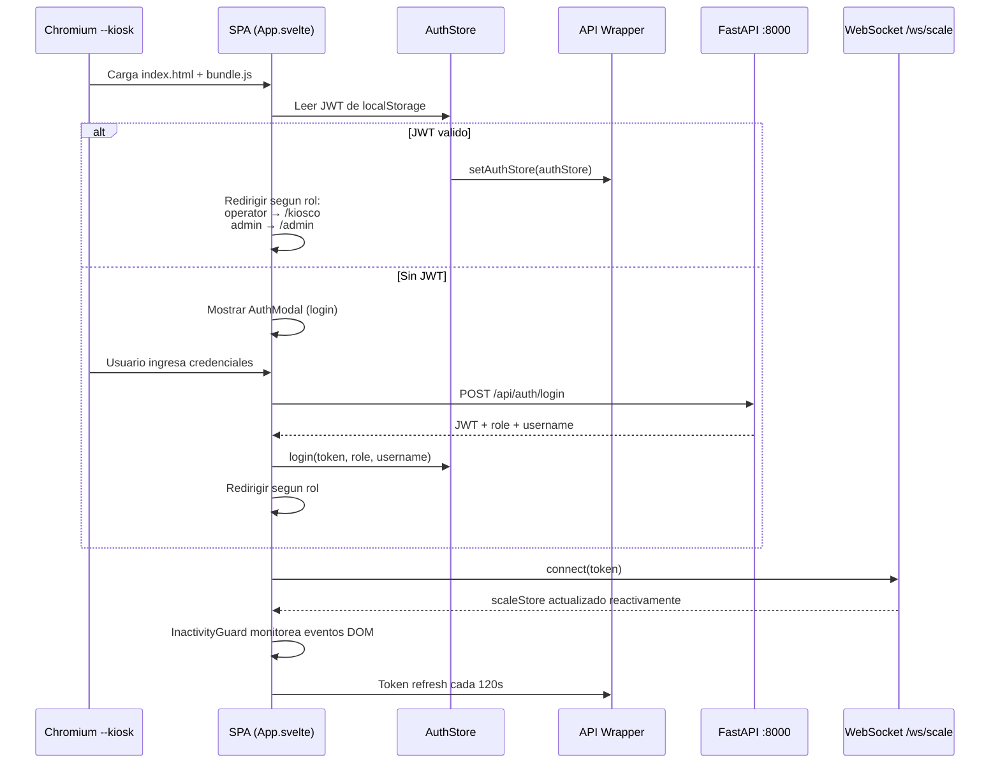
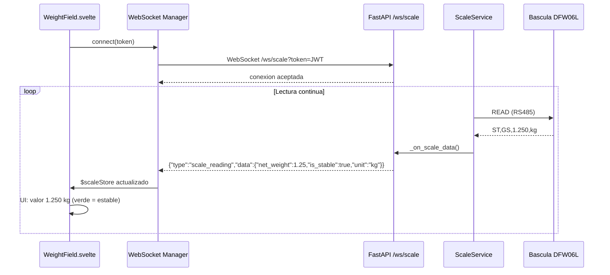

---
## Informe de Progreso 4: Desarrollo del Frontend — SIP-Edge

> **Alcance:** Arquitectura del frontend SPA, stack tecnologico, componentes implementados,
> librerias de soporte, ruteo, autenticacion, comunicacion en tiempo real, tests, y decisiones de diseno.
> **Fecha:** Julio 2026

---

### 1. Stack Tecnologico

| Componente | Tecnologia | Version | Justificacion |
|------------|------------|---------|---------------|
| **Framework** | Svelte 5 | ^5.25.0 | Compilado a JS puro; 0 KB runtime; reactividad nativa con runes (`$state`, `$derived`, `$effect`) |
| **Build Tool** | Vite | ^6.2.0 | Tree-shaking, HMR en desarrollo, optimizacion de bundle |
| **Ruteo** | svelte-spa-router | ^4.0.1 | Hash-based routing, ~3 KB |
| **Testing** | Vitest | ^4.1.9 | Compatible con Vite, ejecucion rapida |
| **Test DOM** | jsdom | ^29.1.1 | Simulacion de DOM para tests |
| **Test Utils** | @testing-library/svelte | ^5.3.1 | Renderizado y queries de componentes |
| **CSS** | Vanilla CSS + variables | — | Sin frameworks externos |
| **Plugin** | @sveltejs/vite-plugin-svelte | ^5.1.1 | Integracion Svelte con Vite |

### 1.1 Lo que NO se incluye

| Tecnologia | Motivo |
|------------|--------|
| React / Vue | Runtime innecesario (42 KB / 33 KB) en EdgeBox con RAM limitada |
| TypeScript | Complejidad innecesaria para una app industrial con tipado via JSDoc |
| Axios | `fetch` nativo cubre todos los casos |
| Socket.IO | WebSocket nativo del navegador |
| Bootstrap / Tailwind / Material UI | Peso innecesario para ~11 vistas; CSS vanilla con variables CSS |
| Redux / Zustand | Svelte 5 tiene reactividad nativa con `$state` |
| moment.js / date-fns | `Intl.DateTimeFormat` nativo |

---

### 2. Arquitectura del Frontend

#### 2.1 Estructura de Archivos

```
frontend/
├── index.html                      # Punto de entrada HTML
├── package.json                    # Dependencias y scripts
├── vite.config.js                  # Configuracion Vite (proxy dev, base path)
├── vitest.config.js                # Configuracion Vitest
├── svelte.config.js                # Configuracion Svelte
└── src/
    ├── main.js                     # Inicializacion: montar App, registrar auth store
    ├── App.svelte                  # Componente raiz: auth gate, ruteo, layouts
    ├── app.css                     # Variables CSS globales, reset, tipografia
    ├── setupTest.js                # Configuracion global para tests
    ├── lib/                        # Utilidades sin UI
    │   ├── api.js                  # Wrapper fetch: JWT, 401 interception, ApiError
    │   ├── ws.js                   # WebSocket manager: /ws/scale, reconexion
    │   ├── router.js               # Hash-based SPA router con svelte/store
    │   ├── auth.js                 # (en stores/) Auth con JWT, refresh, inactividad
    │   ├── inactivity.js           # Timer de inactividad
    │   └── constants.js            # Endpoints, config, roles, harvest types
    ├── stores/                     # Estado reactivo global
    │   ├── auth.js                 # Auth store: token, rol, login/logout/refresh
    │   └── emergency.js            # Estado modo emergencia (polling cada 5s)
    └── components/                 # Componentes Svelte (33 archivos)
        ├── AuthModal.svelte        # Login + flujo reset PIN + cambio password
        ├── KioskLayout.svelte      # Layout modo kiosco (tabs: Pesaje|Historial|Haciendas|Suertes)
        ├── AdminLayout.svelte      # Layout panel admin (sidebar + contenido)
        ├── KioskForm.svelte        # Formulario multipaso de pesaje
        ├── WeightField.svelte      # Campo peso con Tara/Leer + WebSocket vivo
        ├── ScaleReader.svelte      # Lector de balanza: comando READ + display
        ├── HaciendaCodeInput.svelte # Campo codigo hacienda con autocompletado
        ├── NotesField.svelte       # Campo notas colapsable para observaciones
        ├── HistoryTable.svelte     # Tabla historial de pesajes
        ├── EmergencyBanner.svelte  # Banner modo emergencia activo
        ├── EmergencyModal.svelte   # Modal solicitud emergencia (supervisor + motivo)
        ├── ConfirmModal.svelte     # Modal generico de confirmacion
        ├── InactivityGuard.svelte  # Monitoreo inactividad + logout automatico
        ├── LogoutButton.svelte     # Boton cerrar sesion (siempre visible)
        ├── AdminDashboard.svelte   # Dashboard admin: cards acceso rapido
        ├── Sidebar.svelte          # (en AdminLayout) Navegacion lateral admin
        ├── AdminConfig.svelte      # Configuracion RS485/RS232/GSM + thresholds
        ├── AdminUsers.svelte       # CRUD usuarios con paginacion
        ├── UserFormModal.svelte    # Modal crear/editar usuario
        ├── AdminHaciendas.svelte   # CRUD haciendas con soft-delete
        ├── HaciendaFormModal.svelte # Modal crear/editar hacienda
        ├── AdminSuertes.svelte     # CRUD suertes filtrable por hacienda
        ├── SuerteFormModal.svelte  # Modal crear/editar suerte
        ├── AdminReportes.svelte    # Listado plantillas de reporte
        ├── TemplateFormModal.svelte # Modal crear/editar plantilla (horarios, metricas, users)
        ├── AdminAnomalias.svelte   # Historial anomalias + reporte LLM expandible
        ├── AdminAgente.svelte      # Consola chat con agente IA
        ├── AdminBackup.svelte      # Estado + ejecucion backups con paginacion
        ├── AdminPlaceholder.svelte # Placeholder para secciones admin no implementadas
        ├── WeighingDetailModal.svelte # Modal detalle de pesaje individual
        ├── ResetPinModal.svelte    # Modal ingreso PIN (flujo reset password)
        ├── ResetPasswordModal.svelte # Modal cambio password (flujo reset)
        └── __tests__/              # Tests unitarios por componente (17 archivos)
```

#### 2.2 Ciclo de Vida de la Aplicacion



---

### 3. Librerias de Soporte (lib/)

#### 3.1 API Wrapper (`api.js` — 139 lineas)

Encapsula todas las llamadas HTTP al backend con:

| Funcionalidad | Implementacion |
|---------------|----------------|
| JWT automatico | Header `Authorization: Bearer <token>` en cada request |
| Interceptor 401 | Si el backend responde 401, fuerza `authStore.logout()` y muestra modal login |
| Errores tipados | `ApiError` con `message`, `status`, `data` |
| Content-Type | `application/json` automatico en POST/PUT con body |
| Query strings | `buildQuery()` helper para parametros de paginacion/filtro |
| Sin dependencias | Solo `fetch` nativo |

API publica:
```javascript
import { api, buildQuery, ApiError, setAuthStore } from "./lib/api.js";

// GET
const users = await api.get("/api/users" + buildQuery({ page: 1, page_size: 20 }));

// POST
await api.post("/api/weighings", { tractomula: "ABC123", ... });

// PUT
await api.put("/api/config", { rs485: { baudrate: 9600 } });

// DELETE
await api.del("/api/haciendas/42");
```

#### 3.2 WebSocket Manager (`ws.js` — 126 lineas)

Gestiona la conexion WebSocket a `/ws/scale` para lecturas de bascula en vivo.

| Funcionalidad | Implementacion |
|---------------|----------------|
| Conexion | `connect(token)` — construye URL con JWT via query param |
| Reconexion | Hasta 5 intentos, intervalo 2s entre intentos |
| Estado reactivo | `scaleStore` derivado de 4 stores internos: `net_weight`, `is_stable`, `unit`, `connected` |
| Auto-capture | Callback `onScaleReading()` para captura automatica desde boton PRINT |
| Desconexion | `disconnect()` — cierra WebSocket, limpia timers |

```javascript
import { scaleStore, connect, disconnect, onScaleReading } from "./lib/ws.js";

// Suscribirse reactivamente (en componente Svelte)
$: ({ net_weight, is_stable, unit } = $scaleStore);

// Registrar callback para auto-capture PRINT
onScaleReading((data) => {
  if (data.is_stable && capturaActiva) {
    capturarPeso(data.net_weight);
  }
});
```

#### 3.3 Router (`router.js` — 62 lineas)

Router SPA basado en hash (`#/kiosco`, `#/admin/config`). Sin dependencia de `svelte-spa-router` para el ruteo interno de layouts.

| Funcionalidad | Implementacion |
|---------------|----------------|
| Hash-based | `window.location.hash` — compatible con cualquier servidor, sin configuracion de fallback |
| Reactivo | Store de Svelte (`writable`) que notifica cambios a suscriptores |
| Navegacion | `navigate(route)` — actualiza hash y notifica |
| Ruta actual | `getRoute()` — valor sincrono del store |
| Listeners | `onRouteChange(fn)` — para logica de guarda de rutas |

#### 3.4 Inactivity Monitor (`inactivity.js` — 45 lineas)

Timer que verifica periodicamente si la sesion expiro por inactividad.

| Funcionalidad | Implementacion |
|---------------|----------------|
| Verificacion | `checkInactivity(lastActivity, timeoutMinutes)` — compara timestamp de ultima actividad con timeout |
| Timer | `startInactivityTimer(getLastActivity, getTimeout, onExpired)` — intervalo configurable (60s) |
| Timeout default | 30 minutos, configurable via `session_timeout_minutes` en JWT payload |

#### 3.5 Constants (`constants.js` — 68 lineas)

Centraliza todas las URLs, configuracion y enumeraciones:

```javascript
export const ENDPOINTS = {
  LOGIN: "/api/auth/login",
  WEIGHINGS: "/api/weighings",
  HACIENDAS: "/api/haciendas",
  SUERTES: "/api/suertes",
  EMERGENCY_STATUS: "/api/emergency/status",
  WS_SCALE: "/ws/scale",
  // ... 25 endpoints en total
};

export const CONFIG = {
  DEFAULT_SESSION_TIMEOUT_MINUTES: 30,
  WS_RECONNECT_ATTEMPTS: 5,
  WS_RECONNECT_INTERVAL_MS: 2000,
  INACTIVITY_CHECK_INTERVAL_MS: 60000,
  REFRESH_INTERVAL_MS: 120000,
  DEFAULT_PAGE_SIZE: 20,
};

export const HARVEST_TYPES = [
  "Manual - Incendio", "Manual - Quemado", "Manual - Verde",
  "Mecanico - Incendio", "Mecanico - Verde",
  "No convencional - Verde",
];
```

---

### 4. Estado Global (stores/)

#### 4.1 Auth Store (`auth.js` — 118 lineas)

Store reactivo central para autenticacion. Expuesto a toda la app via `setAuthStore()`.

| Store interno | Tipo | Descripcion |
|---------------|------|-------------|
| `_token` | writable | JWT (persiste en localStorage) |
| `_role` | writable | Rol del usuario (admin/operator) |
| `_username` | writable | Nombre de usuario |
| `_lastActivity` | writable | Timestamp Unix de ultima interaccion |
| `_isAuthenticated` | derived | `!!token && !!role` |
| `_isOperator` | derived | `role === "operator"` |
| `_isAdmin` | derived | `role === "admin"` |
| `_jwtPayload` | derived | Decodifica payload JWT (iat, exp, session_timeout_minutes) |

Metodos publicos:
- `login(token, role, username)` — actualiza stores + localStorage
- `logout()` — limpia stores + localStorage + redirige a login
- `updateLastActivity()` — registra interaccion del usuario (llamado por InactivityGuard)
- `refreshToken()` — POST /api/auth/refresh, actualiza JWT sin re-login
- `getSessionTimeout()` — extrae `session_timeout_minutes` del payload JWT

#### 4.2 Emergency Store (`emergency.js`)

Estado del modo manual de emergencia. Polling cada 5 segundos a `GET /api/emergency/status`.

---

### 5. Sistema de Diseno (CSS)

#### 5.1 Paleta de Colores Actual

```css
:root {
  --bg-primary: #1a1a2e;       /* Fondo principal — azul muy oscuro */
  --bg-secondary: #16213e;     /* Fondo secundario — cards, sidebar */
  --bg-input: #0f3460;         /* Fondo de inputs */
  --text-primary: #e0e0e0;     /* Texto principal — blanco humo */
  --text-secondary: #a0a0b0;   /* Texto secundario — gris */
  --accent: #e94560;           /* Acento — rojo coral (botones, activo) */
  --accent-hover: #c73652;     /* Acento hover */
  --success: #51cf66;          /* Verde — exito, estable */
  --error: #ff6b6b;            /* Rojo — error, inestable */
  --warning: #ffd43b;          /* Amarillo — procesando, alerta */
  --border: #333;              /* Bordes */
}
```

> **Nota:** Esta paleta es temporal (tema oscuro industrial generico). La feature F43
> (`corporate_branding`) aplicara la paleta corporativa de Ingenio Mayaguez:
> primario `#fab900`, acento `#ff0032`, grises `#878787`/`#646464`, tipografia Montserrat.

#### 5.2 Principios de Diseno

| Principio | Aplicacion |
|-----------|------------|
| **Alto contraste** | Fondo oscuro, texto claro. Legible en condiciones de iluminacion industrial. |
| **Fuentes grandes** | Minimo 16px labels, 20px inputs, 32px peso en vivo. Operadores no fuerzan la vista. |
| **Una accion por vista** | En kiosco: boton "Confirmar Medida" grande y destacado. |
| **Feedback inmediato** | Toda accion muestra exito/error inline, sin recargar pagina. |
| **Confirmacion destructiva** | Reset, logout, eliminar → modal de confirmacion obligatorio. |
| **Modo kiosco sin escapes** | Sin barra direcciones, sin Ctrl+T, sin descargas. Solo Logout desde la app. |

---

### 6. Componentes por Vista

#### 6.1 Login y Autenticacion

| Componente | Funcion |
|------------|---------|
| `AuthModal.svelte` | Modal con 3 estados: login (usuario + password), reset PIN (usuario + PIN 4 digitos), cambio password (nueva + confirmacion). Flujo completo de reset via SMS. |
| `LogoutButton.svelte` | Boton "Cerrar sesion" visible en esquina superior derecha de todas las vistas. |
| `InactivityGuard.svelte` | Componente invisible que monitorea eventos DOM (click, teclado, touch). Actualiza `lastActivity` en authStore. Expulsa al usuario si el timeout se supera. |

#### 6.2 Kiosko de Pesaje

| Componente | Funcion |
|------------|---------|
| `KioskLayout.svelte` | Layout con 4 tabs: [Pesaje] [Historial] [Haciendas] [Suertes]. Barra superior con logo, Logout, EmergencyBanner. |
| `KioskForm.svelte` | Formulario multipaso: tractomula, vagon, guia, HaciendaCodeInput, Suerte (cascada), 3x WeightField (muestra, mineral, vegetal), tipo cosecha, NotesField, Confirmar, Reset individual. |
| `WeightField.svelte` | Campo de peso con botones [Tara] y [Leer]. Muestra valor en vivo del WebSocket. Indicador visual de estabilidad (verde = estable, rojo = inestable). |
| `ScaleReader.svelte` | Envia comando READ a la bascula via `POST /api/scale/command` y recibe respuesta. Boton [Capturar] para fijar el peso. |
| `HaciendaCodeInput.svelte` | Campo de texto donde el operador teclea el codigo de hacienda. Autocompletado client-side sobre todas las haciendas cargadas. Si no existe: boton [Crear nueva hacienda]. |
| `NotesField.svelte` | Campo de texto colapsable para notas/observaciones del operador. Boton [+ Notas] para expandir. |
| `HistoryTable.svelte` | Tabla paginada con historial de pesajes del operador. Columnas: fecha, hora, hacienda, suerte, tractomula, vagon, 3 pesos, notas. |
| `EmergencyBanner.svelte` | Banner rojo fijo en la parte superior cuando el modo manual esta activo. Muestra tiempo restante. Polling cada 5s a `GET /api/emergency/status`. |
| `EmergencyModal.svelte` | Modal para solicitar modo manual: seleccionar supervisor (admin), ingresar motivo, enviar solicitud SMS. |

#### 6.3 Panel de Administracion

| Componente | Funcion |
|------------|---------|
| `AdminLayout.svelte` | Layout con sidebar izquierdo + area de contenido. Sidebar resalta seccion activa. |
| `AdminDashboard.svelte` | 5 cards de acceso rapido: Configuracion, Usuarios, Haciendas/Suertes, Reportes, Backup. |
| `AdminConfig.svelte` | Formularios RS485, RS232, GSM con selects de valores predefinidos. Botones Test con resultado inline. Session timeout + scale timeout. Setup card "Limites de Control" (F33). |
| `AdminUsers.svelte` | Tabla paginada (10/20/50/100). Columnas: Usuario, Nombre, Cod. Empresa, Telefono, Rol, Activo. Botones crear, editar, desactivar con confirmacion. |
| `AdminHaciendas.svelte` | Tabla paginada con soft-delete. Columnas: Codigo, Nombre, Creado por, Fecha. |
| `AdminSuertes.svelte` | Dropdown de hacienda + tabla filtrada de suertes. |
| `AdminReportes.svelte` | Tabla de plantillas: Nombre, Horarios, Metricas, Activo. CRUD via TemplateFormModal. |
| `AdminAnomalias.svelte` | Tabla paginada de anomalias. Click expande reporte narrativo del LLM. |
| `AdminAgente.svelte` | Interfaz tipo chat: historial de mensajes, input de texto, boton enviar. Llama a `POST /api/agent/query`. |
| `AdminBackup.svelte` | Tabla de ultimos backups (paginada). Boton [Ejecutar Backup] (deshabilitado 30s tras exito). Boton [Refrescar]. |

#### 6.4 Modales Reutilizables

| Componente | Funcion |
|------------|---------|
| `ConfirmModal.svelte` | Modal generico: titulo, mensaje, botones Confirmar/Cancelar. Usado para reset, logout, eliminacion. |
| `UserFormModal.svelte` | Formulario crear/editar usuario: username, password, full_name, employee_code, phone, role, is_active. |
| `HaciendaFormModal.svelte` | Formulario crear/editar hacienda: codigo, nombre. |
| `SuerteFormModal.svelte` | Formulario crear/editar suerte: codigo (max 4 chars), hacienda padre (preseleccionada). |
| `TemplateFormModal.svelte` | Formulario plantilla: nombre, horarios (checkboxes 24h), metricas (checkboxes 9 opciones), destinatarios (multi-select users), activo. |
| `WeighingDetailModal.svelte` | Detalle completo de un pesaje individual (todos los campos). |
| `ResetPinModal.svelte` | Paso 1 del reset: usuario + PIN de 4 digitos. |
| `ResetPasswordModal.svelte` | Paso 2 del reset: nueva password + confirmacion. |

---

### 7. Comunicacion con el Backend

#### 7.1 Patron de Datos

Todos los componentes usan el mismo patron para interactuar con la API:

```javascript
import { api, buildQuery, ApiError } from "../lib/api.js";

// Estado local reactivo (Svelte 5 runes)
let data = $state([]);
let loading = $state(false);
let error = $state("");

async function loadData() {
  loading = true;
  error = "";
  try {
    const result = await api.get("/api/usuarios" + buildQuery({ page: 1, page_size: 20 }));
    data = result.items;
  } catch (e) {
    if (e instanceof ApiError) {
      error = e.message; // "Sesión expirada..." o "Error del servidor..."
    } else {
      error = "Error de conexión";
    }
  } finally {
    loading = false;
  }
}
```

#### 7.2 WebSocket — Escala en Vivo



#### 7.3 Refresh de Token

Cada 120 segundos, `authStore.refreshToken()` llama a `POST /api/auth/refresh`. Si el backend responde con un nuevo JWT, se actualiza en localStorage sin interrumpir al usuario. Si falla (401), se fuerza logout.

---

### 8. Ruteo

#### 8.1 Arbol de Rutas

```
/                           → Redirige segun JWT y rol
├── /kiosco                 → KioskForm (operator)
├── /kiosco/historial       → HistoryTable (operator)
├── /kiosco/haciendas       → AdminHaciendas (operator, F38)
├── /kiosco/suertes         → AdminSuertes (operator, F38)
├── /admin                  → AdminDashboard (admin)
├── /admin/config           → AdminConfig (admin)
├── /admin/usuarios         → AdminUsers (admin)
├── /admin/haciendas        → AdminHaciendas (admin)
├── /admin/suertes          → AdminSuertes (admin)
├── /admin/reportes         → AdminReportes (admin)
├── /admin/anomalias        → AdminAnomalias (admin)
├── /admin/agente           → AdminAgente (admin)
└── /admin/backup           → AdminBackup (admin)
```

#### 8.2 Control de Acceso por Ruta

App.svelte verifica el rol antes de renderizar:

```svelte
{#if $authStore.isAuthenticated}
  {#if $authStore.isAdmin}
    <AdminLayout />
  {:else if $authStore.isOperator}
    <KioskLayout />
  {/if}
{:else}
  <AuthModal />
{/if}
```

Si un operador intenta acceder a `/admin/*` por URL directa, el backend rechaza con 401/403 y el interceptor 401 del API wrapper fuerza logout.

---

### 9. Build y Despliegue

#### 9.1 Configuracion Vite

```javascript
// vite.config.js
export default defineConfig({
  plugins: [svelte()],
  base: "/static/",         // Base path para assets en produccion
  build: {
    outDir: "dist",
    assetsDir: "assets",
  },
  server: {
    port: 5173,
    proxy: {                 // Proxy en desarrollo
      "/api": "http://localhost:8000",
      "/ws": { target: "ws://localhost:8000", ws: true },
    },
  },
});
```

#### 9.2 Pipeline de Build

```bash
# 1. Desarrollo (con HMR)
cd frontend && npm run dev

# 2. Tests
npm test

# 3. Build para produccion
npm run build                     # Produce dist/

# 4. Copiar a src/static/ (FastAPI sirve desde ahi)
rm -rf ../src/static/*
cp -r dist/* ../src/static/

# 5. En EdgeBox: reiniciar servicio
sudo systemctl restart sip-edge
```

#### 9.3 Bundle Final

| Archivo | Tamano aprox. |
|---------|---------------|
| `index.html` | ~500 B |
| `bundle.js` | ~50-80 KB (min + gz) |
| `bundle.css` | ~5-15 KB (min + gz) |
| **Total** | **~80 KB** |

Sin Node.js, sin npm, sin runtime en produccion. FastAPI sirve los estaticos directamente.

---

### 10. Tests

#### 10.1 Configuracion

```javascript
// vitest.config.js
export default defineConfig({
  test: {
    environment: "jsdom",
    setupFiles: ["./src/setupTest.js"],
  },
});
```

#### 10.2 Archivos de Test (17)

| Archivo | Componente probado |
|---------|-------------------|
| `KioskForm.test.js` | Formulario de pesaje multipaso |
| `KioskLayout.test.js` | Layout kiosco con tabs |
| `AdminUsers.test.js` | CRUD usuarios + paginacion |
| `AdminHaciendas.test.js` | CRUD haciendas + soft-delete |
| `AdminSuertes.test.js` | CRUD suertes + filtro |
| `AdminConfig.test.js` | Configuracion puertos + test |
| `AdminBackup.test.js` | Estado backups + ejecucion |
| `AdminReportes.test.js` | CRUD plantillas reporte |
| `AdminAnomalias.test.js` | Historial anomalias |
| `AdminAgente.test.js` | Consola chat IA |
| `UserFormModal.test.js` | Modal crear/editar usuario |
| `HaciendaFormModal.test.js` | Modal crear/editar hacienda |
| `SuerteFormModal.test.js` | Modal crear/editar suerte |
| `TemplateFormModal.test.js` | Modal plantilla reporte |
| `ConfirmModal.test.js` | Modal confirmacion generico |
| `HaciendaCodeInput.test.js` | Campo codigo hacienda (F36) |
| `WeightField.test.js` | Campo peso + WebSocket |
| `HistoryTable.test.js` | Tabla historial |

#### 10.3 Ejecucion

```bash
cd frontend
npm test                  # Todos los tests
npm test -- --watch       # Modo watch (desarrollo)
```

---

### 11. Decisiones Arquitectonicas (ADR)

#### ADR-01: SPA compilado, no SSR

| Opcion | Veredicto |
|--------|-----------|
| HTMX + Jinja2 (SSR) | RECHAZADO — rendering en backend compite por core 3 |
| SPA compilado (Svelte) | SELECCIONADO — rendering en Chromium, backend solo sirve JSON |

#### ADR-02: Svelte 5 como framework

| Opcion | Bundle | Veredicto |
|--------|--------|-----------|
| Svelte 5 | ~0 KB runtime | SELECCIONADO |
| Preact | ~3 KB | Alternativa viable |
| React | ~42 KB | RECHAZADO |

#### ADR-03: Sin servidor web adicional (no nginx)

FastAPI sirve `src/static/` directamente. Mismo puerto 8000, sin CORS, sin procesos extra, sin RAM adicional.

#### ADR-04: Sin librerias externas de UI

CSS vanilla con variables. Una app industrial con ~13 vistas no justifica un framework CSS. Si el proyecto crece significativamente, evaluar Tailwind CSS con purga en build.

#### ADR-05: WebSocket nativo, no librerias

API WebSocket del navegador para `/ws/scale`. Sin Socket.IO, sin dependencias.

#### ADR-06: Hash-based routing

`#/kiosco`, `#/admin/config`. Compatible con cualquier servidor sin configuracion de fallback. Sin dependencia de history API (no hay navegacion hacia atras en kiosco).

#### ADR-07: Stores de Svelte para estado global

Auth, emergency, scale. Sin Redux, sin Zustand. La reactividad nativa de Svelte 5 con `writable`/`derived` cubre todos los casos.

---

### 12. Resumen

| Metrica | Valor |
|---------|-------|
| **Componentes Svelte** | 33 |
| **Archivos de test** | 17 |
| **Librerias de soporte** | 6 (api, ws, router, inactivity, constants, auth store) |
| **Rutas SPA** | 14 |
| **Dependencias npm** | 3 (svelte, svelte-spa-router, vite) + 4 devDependencies |
| **Bundle produccion** | ~80 KB (sin Node.js en EdgeBox) |
| **Paleta de colores** | Tema oscuro industrial (pendiente F43: colores corporativos Mayaguez) |
| **Integraciones** | REST (45+ endpoints), WebSocket (escala en vivo), localStorage (JWT) |

---

*Documento generado a partir del analisis del codigo fuente del frontend (33 componentes, 6 librerias, 17 tests), los specs SDD de frontend (F13-F17), y la configuracion real de build desplegada en los EdgeBox EB1 y EB2.*
