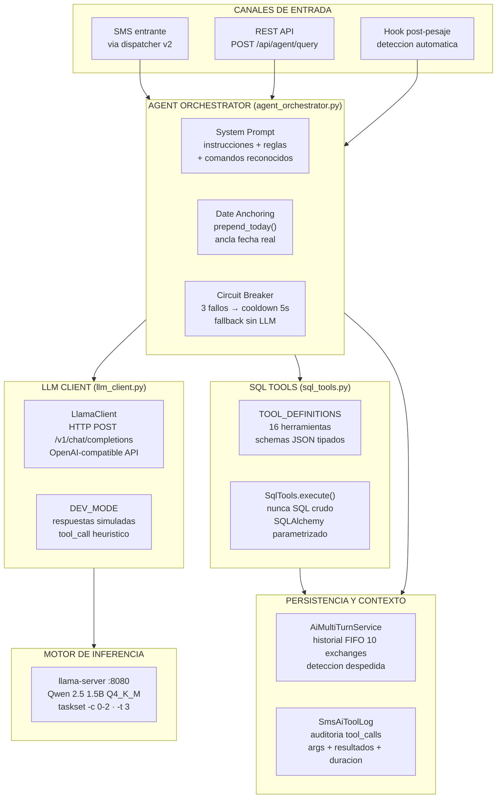
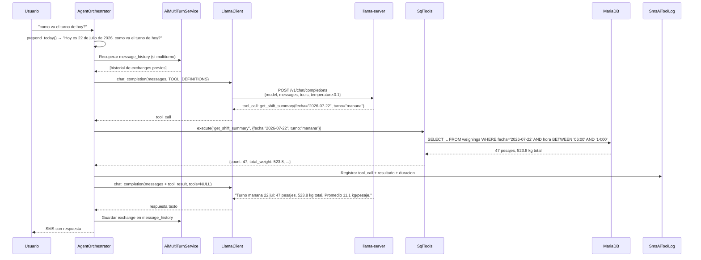
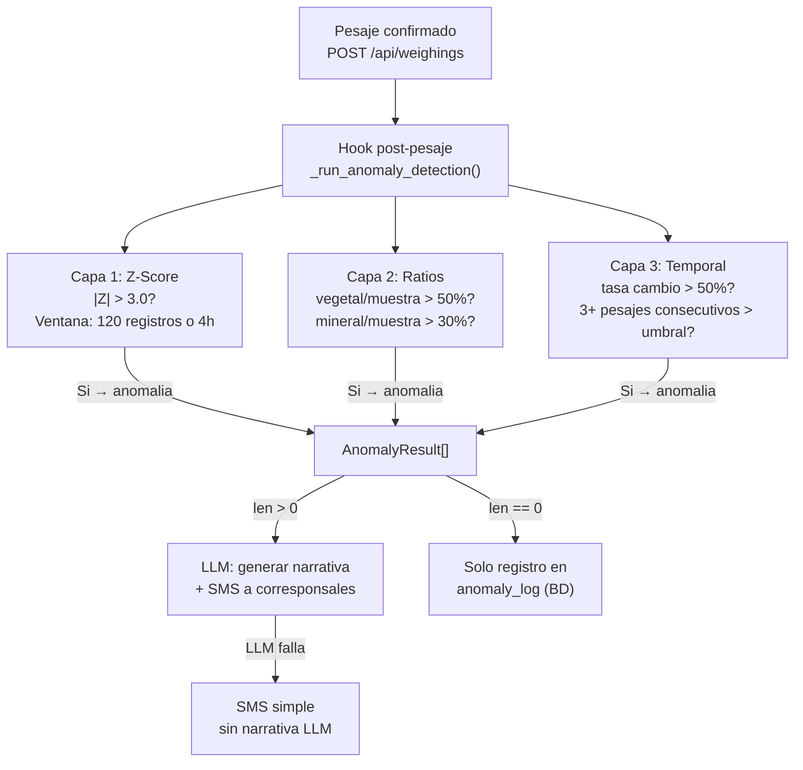

---
## Informe de Progreso 5: Capa de Inteligencia Artificial — SIP-Edge

> **Alcance:** Arquitectura del subsistema LLM, cliente agnostico al modelo, catalogo de herramientas
> SQL, sistema de deteccion de anomalias, controles de seguridad anti-inyeccion, orquestacion
> de consultas multiturno, CPU pinning, y metricas de rendimiento.
> **Fecha:** Julio 2026

---

### 1. Resumen Ejecutivo

#### 1.1 Proposito: Por que un LLM

La decision de incorporar un modelo de lenguaje (LLM) en SIP-Edge responde a una necesidad
concreta del entorno operativo: **los corresponsales y supervisores acceden al sistema
unicamente via SMS desde telefonos moviles convencionales, sin acceso a la interfaz web.**

Una interfaz tradicional de comandos SMS (estilo `PESOS 2026-07-22 HACIENDA 131`) impondria
una carga cognitiva alta sobre usuarios no tecnicos: memorizacion de sintaxis, orden estricto
de argumentos, formato de fechas, codigos de hacienda, y cero tolerancia a errores de tipeo.
En la practica, esto resulta en abandono del sistema o dependencia de un "manual de comandos"
que rara vez se consulta en campo.

El LLM invierte este paradigma: **el usuario se comunica en lenguaje natural y el sistema
se adapta a el, no al reves.**

| Dimension | Comandos tradicionales | LLM + Function Calling |
|-----------|----------------------|------------------------|
| **Sintaxis** | Fija, debe memorizarse | Libre, lenguaje natural |
| **Errores de tipeo** | Rechazo silencioso o error | El LLM interpreta la intencion |
| **Ambiguedad** | No tolerada | El LLM puede pedir aclaracion ("te refieres al 14 o al 15 de junio?") |
| **Contexto** | Cada mensaje es independiente | El LLM mantiene contexto multiturno, entiende pronombres y referencias implicitas |
| **Curva de aprendizaje** | Alta (requiere capacitacion) | Cero (hablar/escribir como siempre) |
| **Flexibilidad temporal** | Comandos especificos por periodo | "hoy", "ayer", "esta semana", "este mes" resueltos automaticamente |
| **Consultas complejas** | Multiples comandos encadenados | Una sola pregunta en lenguaje natural |
| **Adopcion** | Baja sin entrenamiento | Inmediata |

**Ejemplo real de la diferencia:**

```
Comando tradicional:
  RESUMEN HACIENDA=131 FECHA_INI=2026-07-15 FECHA_FIN=2026-07-22 METRICA=PROMEDIO TIPO=MINERAL

LLM:
  "como ha estado el mineral en la hacienda 131 esta semana?"
```

**Capacidades adicionales del LLM que serian inviables con comandos:**
- **Correccion de ambiguedad contextual:** Si el usuario pregunto por el 14 jun y luego por
  el 15 jun, y despues pregunta "cual fue el promedio?", el LLM detecta la ambiguedad y
  pregunta "te refieres al 14 o al 15 de junio?"
- **Comprension de seguimiento conversacional:** "y ayer?" despues de preguntar por hoy.
  "y la hacienda XYZ?" despues de un desglose por haciendas.
- **Resolucion de periodos relativos:** "esta semana", "el mes pasado", "los ultimos 15 dias",
  "desde el lunes" — todos resueltos automaticamente con date anchoring.
- **Tolerancia a errores:** "cuantos pesages ubo oy" → el LLM entiende "cuantos pesajes hubo hoy".
- **Formato de respuesta adaptable:** El LLM parafrasea resultados numericos en texto narrativo
  legible, sin necesidad de que el sistema defina plantillas para cada combinacion posible
  de metricas.
- **Deteccion de intencion vs comando:** El LLM distingue entre una consulta de datos
  ("como va el turno?") y un comando del sistema ("manual on"), evitando que comandos
  mal escritos se procesen como consultas.

#### 1.2 Restriccion fundamental

Para evitar el riesgo de alucinacion numerica — el mayor peligro de un LLM en un contexto
industrial — el sistema **NUNCA permite que el LLM genere valores cuantitativos por si mismo**.
En su lugar, el LLM operara exclusivamente mediante **Function Calling**: decide QUE herramienta
SQL ejecutar, pero los valores numericos siempre provienen de MariaDB, ejecutados por codigo
Python deterministico. El LLM solo parafrasea en lenguaje natural los resultados reales.

#### 1.3 Dimensiones Tecnicas

| Metrica | Valor |
|---------|-------|
| **Modulos dedicados** | 6 (agent_orchestrator, ai_multi_turn, anomaly_detector, llm_client, sql_tools, report_templates) |
| **Lineas de codigo** | ~3,400 |
| **Herramientas SQL** | 16 (TOOL_DEFINITIONS) |
| **Capas de deteccion** | 3 (Z-Score, ratios, temporal) |
| **Modelo en produccion** | Qwen 2.5 1.5B Instruct Q4_K_M (1.1 GB) |
| **Rendimiento** | ~3.6 t/s generacion, ~7.7 t/s prompt |
| **Cores dedicados** | 3 (cores 0-2 via taskset) |
| **Protocolo** | OpenAI-compatible API via llama-server (localhost:8080) |

---

### 2. Arquitectura

#### 2.1 Diagrama de Capas de IA



#### 2.2 Flujo de Function Calling



---

### 3. Cliente LLM Agnóstico al Modelo

#### 3.1 Diseno

`LlamaClient` (`llm_client.py`, 278 lineas) abstrae la comunicacion con el motor de inferencia
detras de una interfaz unica: `chat_completion(messages, tools, tool_choice)`. Esto permite
cambiar el modelo o el backend sin modificar el orquestador.

```python
class LlamaClient:
    def __init__(self, base_url, model, timeout, dev_mode, api_key=None):
        # base_url: llama-server local (http://127.0.0.1:8080)
        #           o DeepSeek API remoto (https://api.deepseek.com)
        # model: qwen2.5-1.5b-instruct, deepseek-chat, etc.
        # dev_mode: True → respuestas simuladas sin conexion real

    def chat_completion(self, messages, tools=None, tool_choice=None) -> dict:
        # Formato compatible OpenAI API
        # POST {base_url}/v1/chat/completions
        # Envia tools como JSON Schema
        # Retorna dict con choices[{message: {content, tool_calls}}]
```

#### 3.2 Backends Soportados

| Backend | Configuracion | Uso |
|---------|---------------|-----|
| **llama.cpp (local)** | `AI_PRIMARY_BACKEND=local`, `llm_url=http://127.0.0.1:8080` | Produccion EdgeBox |
| **DeepSeek API (remoto)** | `AI_PRIMARY_BACKEND=remote`, `DEEPSEEK_API_KEY=sk-...` | Desarrollo local Docker |
| **Simulado (DEV_MODE)** | `DEV_MODE=true` | Tests unitarios, desarrollo sin LLM |

#### 3.3 Tolerancia a Fallos

```python
# Circuit breaker en AgentOrchestrator
class AgentOrchestrator:
    def __init__(self, ...):
        self._llm_failure_count = 0
        self._llm_cooldown_until = 0
        self._llm_cooldown_seconds = 5  # 5s cooldown (LLM local rapido)

    def _llm_available(self) -> bool:
        if self._llm_failure_count >= 3:
            if time.time() < self._llm_cooldown_until:
                return False  # Circuito abierto
            self._llm_failure_count = 0  # Reset tras cooldown
        return True
```

**Comportamiento ante fallos:**
- 3 fallos consecutivos → circuito abierto, cooldown 5 segundos
- Durante el cooldown: consultas SMS reciben respuesta de error generica
- Anomalias se registran en BD sin reporte narrativo del LLM
- El servicio de pesaje NO se interrumpe (hook post-pesaje atrapa excepciones)

---

### 4. Catalogo de Herramientas SQL (16 tools)

#### 4.1 Arquitectura

Cada herramienta se define en `TOOL_DEFINITIONS` como un schema JSON que el LLM recibe
en el system prompt. Las definiciones siguen el formato OpenAI Function Calling:

```python
TOOL_DEFINITIONS = [
    {
        "type": "function",
        "function": {
            "name": "get_basic_stats",
            "description": "Obtiene estadisticas basicas...",
            "parameters": {
                "type": "object",
                "properties": {
                    "fecha_inicio": {"type": "string", "description": "YYYY-MM-DD"},
                    "fecha_fin": {"type": "string", "description": "YYYY-MM-DD"},
                    "tipo_material": {"type": "string", "description": "muestra, mineral, vegetal"},
                    "agrupacion": {"type": "string", "description": "dia, semana, mes, turno"},
                    "periodo": {"type": "string", "description": "hoy, ayer, ultimos_7_dias, mes_actual"},
                },
                "required": [],
            },
        },
    },
    # ... 15 definiciones mas
]
```

#### 4.2 Herramientas Disponibles

| # | Nombre | Parametros clave | Feature |
|---|--------|-----------------|---------|
| 1 | `get_basic_stats` | fecha_inicio, fecha_fin, tipo_material, agrupacion, tipo_vehiculo, periodo | F8 |
| 2 | `get_percentiles` | fecha_inicio, fecha_fin, percentil | F8 |
| 3 | `get_moving_average` | window_size, tipo_material | F8 |
| 4 | `get_trend` | fecha_inicio, fecha_fin, tipo_material | F8 |
| 5 | `get_breakdown_by_hacienda` | fecha_inicio, fecha_fin | F8 |
| 6 | `get_breakdown_by_operator` | fecha_inicio, fecha_fin | F8 |
| 7 | `get_material_composition` | fecha_inicio, fecha_fin | F8 |
| 8 | `get_shift_summary` | fecha, turno | F8 |
| 9 | `get_daily_summary` | fecha | F8 |
| 10 | `get_custom_period_summary` | fecha_inicio, fecha_fin | F8 |
| 11 | `detect_anomalies` | window_size, z_threshold | F8 |
| 12 | `check_thresholds` | window_size | F8 |
| 13 | `get_avg_weighing_time` | fecha_inicio, fecha_fin | F33 |
| 14 | `get_anomaly_rate` | fecha_inicio, fecha_fin | F33 |
| 15 | `get_top_haciendas` | fecha_inicio, fecha_fin, top_n | F33 |
| 16 | `get_period_comparison` | fecha_inicio, fecha_fin | F33 |

#### 4.3 Ejecucion Segura

Toda herramienta se ejecuta via `SqlTools.execute()` que:
- Valida parametros contra el schema (tipos, rangos)
- Construye queries con SQLAlchemy ORM parametrizado (nunca concatenacion)
- Usa `func.sum()`, `func.avg()`, `func.stddev_pop()` de SQLAlchemy
- Convierte resultados a tipos nativos Python (Decimal → float)
- Lanza `ToolExecutionError` si falla, atrapada por el orquestador

---

### 5. Sistema de Deteccion de Anomalias

#### 5.1 Arquitectura de 3 Capas



#### 5.2 Capas en Detalle

**Capa 1 — Z-Score con ventana movil:**
- Calcula media y desviacion estandar de los ultimos 120 registros o 4 horas.
- Z = |peso_total - media| / std.
- Umbral: |Z| > 3.0 (configurable en `AgentConfig.z_threshold`).
- Si std == 0 (ventana uniforme), no detecta.
- Complejidad: O(n) sobre la ventana. Tiempo < 500ms.

**Capa 2 — Filtro relacional (ratios entre materiales):**
- Ratio vegetal/muestra: si `peso_vegetal_extrano / peso_muestra > 0.5` → anomalia.
- Ratio mineral/muestra: si `peso_mineral / peso_muestra > 0.3` → anomalia.
- Detecta desbalance en la composicion esperada de materia extrana.

**Capa 3 — Filtro temporal (tasa de cambio y rachas):**
- Tasa de cambio: si |peso_actual - peso_anterior| / peso_anterior > 50% → anomalia.
- Rachas sistematicas: si 3+ pesajes consecutivos superan el umbral Z → anomalia sistemica.
- Detecta cambios bruscos (error de calibracion, cambio de lote) y tendencias anomalas.

#### 5.3 Configuracion

```python
@dataclass(frozen=True)
class AgentConfig:
    llm_url: str = "http://127.0.0.1:8080"
    llm_model: str = "qwen2.5-1.5b-instruct"
    llm_timeout: int = 120
    z_threshold: float = 3.0           # Capa 1
    window_size: int = 120             # Capa 1 (registros)
    window_hours: int = 4              # Capa 1 (horas)
    vegetal_ratio_threshold: float = 0.5  # Capa 2
    mineral_ratio_threshold: float = 0.3  # Capa 2
    change_rate_threshold: float = 0.5    # Capa 3
    consecutive_threshold: int = 3        # Capa 3
```

Todos los umbrales son configurables en `config.yaml` y modificables via API sin reiniciar.

---

### 6. Orquestador Central

#### 6.1 AgentOrchestrator (`agent_orchestrator.py`, 586 lineas)

Punto unico de entrada para todas las interacciones con el LLM. Conecta los modulos
de cliente, herramientas, multiturno y SMS.

**Responsabilidades:**
- Recibir consultas via SMS (dispatcher v2) o API REST
- Anclar fecha real (`prepend_today()`)
- Recuperar historial multiturno (si aplica)
- Enviar al LLM con TOOL_DEFINITIONS
- Ejecutar tool calls contra SqlTools
- Registrar tool calls en SmsAiToolLog (auditoria)
- Reenviar resultados al LLM para parafrasis
- Entregar respuesta final (SMS o JSON)
- Manejar fallos del LLM con circuit breaker

#### 6.2 System Prompt

El system prompt es la unica "barrera de seguridad" entre el usuario y los datos.
Define instrucciones estrictas:

```
Eres un asistente de analisis de datos de pesaje agricola (SIP-Edge).

- NUNCA inventes numeros, totales, promedios ni ninguna metrica cuantitativa.
- Solo reporta valores que provengan de la ejecucion de herramientas SQL.
- Cuando uses herramientas, espera los resultados antes de responder.
- Responde siempre en espanol, en formato conciso para SMS (max 160 caracteres).
- NUNCA uses formato 24-06-2026 porque el operador SMS bloquea las barras.
- Todos los pesos estan en KILOGRAMOS (kg). Si el usuario pregunta en toneladas,
  divide entre 1000. NUNCA digas que un valor en kg son toneladas.
- Si el usuario se despide (gracias, bye, eso es todo), responde con despedida
  cortes y NO llames herramientas.
- Si el usuario envia un comando del sistema (manual on, reset password),
  NO intentes procesarlo como consulta de datos.
```

#### 6.3 Date Anchoring

`prepend_today()` inyecta la fecha real al inicio de cada consulta:

```
"Hoy es 22 de julio de 2026. como va el turno de hoy?"
```

Esto permite al LLM resolver referencias temporales relativas (hoy, ayer, esta semana)
sin depender de su fecha de entrenamiento (que puede ser de 2024).

---

### 7. Conversaciones Multiturno

#### 7.1 AiMultiTurnService (`ai_multi_turn.py`, 369 lineas)

Permite conversaciones continuas via SMS donde el usuario puede hacer preguntas
de seguimiento sin repetir contexto.

**Mecanismo:**
- Cada conversacion SMS (`sms_conversations`) mantiene `message_history` en su campo `metadata` JSON.
- El historial almacena los ultimos 10 exchanges (20 mensajes: user + assistant).
- FIFO: al llegar al limite, el exchange mas antiguo se elimina.
- Tool calls y tool results NO se almacenan en el historial (solo en `SmsAiToolLog`).
- Esto mantiene el contexto ligero (~2-3 KB maximo) para no saturar el prompt del LLM.

**Deteccion de despedida:**
- Keywords: "gracias", "bye", "adios", "chao", "hasta luego", "eso es todo".
- Si se detecta → conversacion pasa a `completed`.
- Conversaciones `completed` sin actividad por 90 dias → `archived` (cleanup diario).

#### 7.2 Ejemplo de Conversacion

```
Usuario: "cuantos pesajes hoy?"
SIP-Edge: "Hoy 22 jul: 47 pesajes, 523.8 kg total."

Usuario: "y cual fue el promedio?"
SIP-Edge: "Promedio hoy: 11.1 kg/pesaje."  [← usa contexto de "hoy"]

Usuario: "y ayer?"
SIP-Edge: "Ayer 21 jul: 51 pesajes, 567.3 kg total. Promedio 11.1 kg/pesaje."

Usuario: "gracias!"
SIP-Edge: "De nada, quedo atento. Buen turno!"
           [← conversacion marcada como completed]
```

---

### 8. Controles de Seguridad y Railes

#### 8.1 Prevencion de Inyeccion de Prompt

| Control | Implementacion |
|---------|---------------|
| **Texto del usuario nunca directo al LLM** | El system prompt envuelve toda consulta. Las instrucciones criticas estan en el prompt base, no en el input del usuario. |
| **Tool calls con schemas tipados** | Cada herramienta tiene un JSON Schema estricto. El LLM solo puede invocar herramientas definidas en TOOL_DEFINITIONS. |
| **Validacion de argumentos** | `SqlTools.execute()` valida tipos, rangos y existencia de parametros antes de ejecutar SQL. |
| **Nunca SQL crudo** | Todas las queries usan SQLAlchemy ORM parametrizado. La concatenacion de strings del usuario en SQL es imposible. |
| **Comandos de sistema filtrados** | El system prompt instruye al LLM a NO procesar comandos del sistema como consultas. Ademas, el SMS dispatcher v2 filtra comandos ANTES de llegar al handler AI. |

#### 8.2 Railes de Comportamiento

| Rail | Descripcion |
|------|-------------|
| **No inventar datos** | System prompt: "NUNCA inventes numeros, totales, promedios ni ninguna metrica cuantitativa." |
| **Solo valores de herramientas** | System prompt: "Solo reporta valores que provengan de la ejecucion de herramientas SQL." |
| **Unidades correctas** | System prompt: "Todos los pesos estan en KILOGRAMOS. Si el usuario pregunta en toneladas, divide entre 1000." |
| **Formato de fecha seguro** | System prompt: "Usa formato 24 jun 2026. NUNCA uses 24-06-2026 (barras bloqueadas por SMS)." |
| **Limite de tokens** | `max_tokens: 512` en la request al LLM. Previene respuestas excesivamente largas que generen multiples SMS. |
| **Temperatura baja** | `temperature: 0.1` — minimiza la creatividad/alucinacion del LLM. |
| **Tool choice forzado** | Cuando hay tools disponibles, `tool_choice: "required"` fuerza al LLM a usar una herramienta en lugar de generar texto libre. Sin tools, el LLM genera texto de parafrasis. |

#### 8.3 Auditoria

| Tabla | Que registra |
|-------|-------------|
| `sms_messages` | Todo SMS entrante y saliente con direccion, cuerpo, handler, estado |
| `sms_conversations` | Contexto multiturno con metadata JSON (message_history) |
| `sms_ai_tool_log` | Cada tool_call ejecutado: nombre, argumentos, resultado, duracion en ms |
| `anomaly_log` | Cada anomalia detectada con capa, Z-Score, reporte LLM, SMS enviado |

---

### 9. CPU Pinning y Rendimiento

#### 9.1 Aislamiento de CPU

```
Core 0: llama-server ─┐
Core 1: llama-server  ├── taskset -c 0-2, 3 threads dedicados
Core 2: llama-server ─┘
Core 3: FastAPI + MariaDB + Chromium + SO ─── 1 core para todo lo demas
```

Configuracion systemd:
```ini
[Service]
ExecStart=/usr/bin/taskset -c 0-2 /usr/local/bin/llama-server \
    -m /home/models/qwen2.5-1.5b-instruct-q4_k_m.gguf \
    -t 3 --threads-batch 3 \
    --host 127.0.0.1 --port 8080 \
    -c 4096
CPUAffinity=0-2
CPUSchedulingPolicy=rr
```

#### 9.2 Metricas de Rendimiento

| Metrica | Valor | Notas |
|---------|-------|-------|
| **Velocidad de prompt** | ~7.7 t/s | Evaluacion del prompt + tool definitions |
| **Velocidad de generacion** | ~3.6 t/s | Generacion de texto de respuesta |
| **RAM del modelo** | ~1.1 GB | Qwen 2.5 1.5B Q4_K_M |
| **Contexto maximo** | 4096 tokens | Suficiente para system prompt + tools + historial multiturno |
| **Latencia tool_call** | 2-5 segundos | Inferencia + ejecucion SQL |
| **Latencia total SMS** | 5-15 segundos | Recepcion SMS + LLM + SQL + envio SMS |
| **Cooldown circuit breaker** | 5 segundos | Tras 3 fallos consecutivos |

#### 9.3 Impacto de TOOL_DEFINITIONS en el Prompt

Cada herramienta en `TOOL_DEFINITIONS` agrega ~200-400 tokens al prompt.
Con 16 herramientas, el overhead es ~4,000-6,000 tokens solo en definiciones.
Esto compite con el contexto disponible (4096 tokens) para el historial multiturno.

**Estrategia de mitigacion:**
- `max_tokens: 512` limita la respuesta.
- Historial multiturno limitado a 10 exchanges FIFO.
- Tool results no se almacenan en el historial (solo texto user+assistant).
- Si se agregan mas herramientas (features futuras), considerar migrar a un modelo
  con mayor contexto (Gemma 4 2B con 8192 tokens, ya descargado en `/home/models/`).

#### 9.4 Modelos Disponibles

| Modelo | Tamano | Contexto | Rendimiento estimado |
|--------|--------|----------|---------------------|
| `qwen2.5-1.5b-instruct-q4_k_m.gguf` | 1.1 GB | 4096 | ~3.6 t/s (produccion) |
| `gemma-4-E2B-it-Q4_K_M.gguf` | 2.9 GB | 8192 | ~1.5-2.0 t/s (estimado) |
| `Qwen3.5-2B-UD-Q2_K_XL.gguf` | 922 MB | 4096 | ~4.0 t/s (estimado, experimental) |

---

### 10. Integracion con el Resto del Sistema

#### 10.1 Puntos de Entrada

| Punto de entrada | Flujo | Handler |
|-----------------|-------|---------|
| SMS entrante (ai_query) | dispatcher v2 → handler chain → agent_orchestrator | `handle_sms_query()` |
| API REST | POST /api/agent/query → agent_orchestrator | `handle_api_query()` |
| Hook post-pesaje | weighings.py → anomaly_detector → agent_orchestrator | `handle_anomaly()` |

#### 10.2 Ciclo de Vida

```python
# En main.py lifespan
llm_client = LlamaClient(
    base_url=agent_config.llm_url,
    model=agent_config.llm_model,
    timeout=agent_config.llm_timeout,
    dev_mode=os.getenv("DEV_MODE", "false").lower() == "true",
)
sql_tools = SqlTools()
ai_multi_turn = AiMultiTurnService(db_session_factory)
agent = AgentOrchestrator(
    llm_client=llm_client,
    sql_tools=sql_tools,
    sms_service=sms_service,
    db_session_factory=SessionLocal,
    ai_multi_turn_service=ai_multi_turn,
)

# Registrar en dispatcher SMS
dispatcher.register_handler("ai_query", agent.handle_sms_query)
```

---

### 11. Resumen

| Aspecto | Implementacion |
|---------|---------------|
| **Arquitectura** | Function Calling via API compatible OpenAI |
| **Modelo** | Agnóstico: Qwen 2.5 1.5B (local), DeepSeek (remoto), simulado (dev) |
| **Herramientas** | 16 SQL parametrizadas con schemas JSON tipados |
| **Deteccion** | 3 capas secuenciales con umbrales configurables |
| **Multiturno** | FIFO 10 exchanges en metadata JSON de sms_conversations |
| **Railes** | No inventar datos, solo tool calls, SQL parametrizado, temperatura 0.1, max_tokens 512 |
| **Anti-inyeccion** | System prompt wrapper, tool schemas, ORM parametrizado, comandos filtrados en dispatcher |
| **Tolerancia** | Circuit breaker 3 fallos → cooldown 5s. Fallback sin LLM para anomalias. |
| **Auditoria** | sms_messages, sms_conversations, sms_ai_tool_log, anomaly_log |
| **Rendimiento** | ~3.6 t/s generacion, ~7.7 t/s prompt, 1.1 GB RAM |
| **CPU** | 3 cores dedicados (0-2) via taskset, 1 core (3) para backend + BD |
| **Modelos** | 3 modelos GGUF disponibles (~4.9 GB total) |

---

*Documento generado a partir del analisis del codigo fuente de 6 modulos de IA (~3,400 lineas),
los specs SDD de features F8 (ai_agent), F28 (ai_multi_turn), F33 (sql_tools_v2),
y la configuracion real de llama-server en los EdgeBox EB1 y EB2.*
